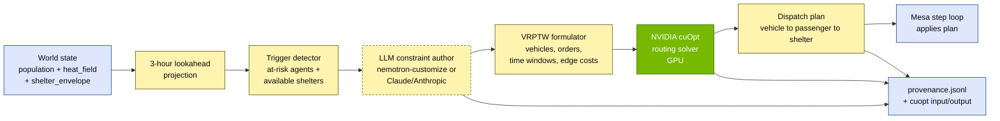

# cuOpt Integration Plan — Stage Two Proactive AV Dispatch

| | |
|---|---|
| **Status** | Planning — Stage Two scope (post 5/25 Stage One review) |
| **Owner** | Sam Duong (Group 3 — Urban Digital Twins) |
| **Decision date** | 2026-06-01 |
| **Companion** | [system_architecture.md](system_architecture.md) · [methodology.md](methodology.md) |

---

## 1. Decision

Replace the planned "custom LLM-driven agentic planner" in `sim/testbed/policy.py` (proactive branch) with **NVIDIA cuOpt routing solver as the optimization engine**, with the LLM acting as the **constraint-authoring + scenario-interpretation layer** on top.

**Stage One (5/25) stays untouched.** Threshold rule continues to drive the proactive policy for the demo. cuOpt lands at Stage Two kickoff.

---

## 2. Why this matters for the research

The original "LLM-driven agentic planner" framing was vague — reviewers would reasonably ask "what optimization is actually happening?" Pivoting to cuOpt gives us:

| Before (LLM planner only) | After (LLM + cuOpt) |
|---|---|
| Black-box decision-making | Reproducible, verifiable optimization |
| Hard to define "optimal dispatch" | Explicit objective + constraints |
| Solver scale unclear | GPU-accelerated, 100s of agents × 10s of shelters trivially |
| Weak NVIDIA-stack story | First-class use of NVIDIA CUDA-X (cuOpt) alongside Omniverse + Isaac Sim |
| Hard to verify against Xilin six-metric methodology | Solver objective maps directly to the six metrics |

The research contribution upgrades from "we wrote an LLM policy" to **"we formulated AV-to-heat-shelter dispatch as a vehicle-routing problem with vulnerability-weighted time windows and heat-cost edges, solved on GPU, with LLM-authored constraints capturing scenario semantics."**

---

## 3. Problem formulation

The proactive policy becomes a **Vehicle Routing Problem with Time Windows (VRPTW)** with the following mapping:

| cuOpt concept | Nihonbashi semantics |
|---|---|
| **Vehicles** | AV fleet (number = scenario parameter; Stage Two starts with 5–10 vehicles) |
| **Vehicle depot** | AV staging area(s) — e.g. one location at Nihonbashi station, optional second at Mitsukoshi |
| **Locations / orders** | Vulnerable agents needing pickup (`vulnerability_score > 0.6` and projected to enter heat-cost hotspot within 3-hour lookahead) + shelter destinations |
| **Time windows** | Per-agent: must arrive at shelter *before* cumulative exposure crosses safe threshold |
| **Demand** | One unit per vulnerable agent (could extend to multi-passenger AV with capacity > 1) |
| **Vehicle capacity** | AV passenger capacity (typically 4–6) |
| **Edge cost** | Travel time + **integrated heat-cost factor along the path** (so the solver naturally avoids hot streets) |
| **Soft constraint penalty** | Vulnerability-weighted lateness (elderly/restricted-mobility lateness penalized harder) |
| **Hard constraint** | Shelter capacity from Group 2's `shelter_envelope.csv` (`max_occupants` per hour) |
| **Custom rules** (`cuopt-user-rules`) | "No agent with `mobility_class=restricted` may be in transit > 15 min" |

---

## 4. Architecture

**LLM is optional** — Stage Two MVP runs cuOpt with hand-coded constraint templates. LLM layer comes online when constraint authoring needs scenario interpretation (e.g. "during typhoon evacuation, double the priority weight for ground-floor elderly residents").

---

## 5. Skill catalog mapping

Skills from `nvidia/skills` we install (after Stage One ships):

| Skill | Used for |
|---|---|
| `cuopt-install` | Initial setup on CURA HPC + RTX 4090 dev box |
| `cuopt-routing-api-python` | Programmatic dispatch-plan generation from `policy.py` |
| `cuopt-routing-formulation` | Authoring the VRPTW model — reference during implementation |
| `cuopt-user-rules` | Custom constraints (mobility class, exposure caps) |
| `cuopt-server-api-python` | Remote solver invocation if cuOpt runs on a separate node |
| `cuopt-developer` | Dev environment ergonomics |

Other relevant skills already in scope:

| Skill | Phase | Purpose |
|---|---|---|
| `omniverse-cad-to-simready` | Stage Two | Yi Tai's SHP → SUMO → USD pipeline |
| `omniverse-realtime-viewer` | Stage Two | High-fidelity dashboard tab |
| `omniverse-usd-performance-tuning` | Stage Two | Hit 30 FPS / 1080p on RTX 4090 |
| `vss-setup-behavior-analytics` | Phase 5-6 | Already adopted per VSS 3.1.0 plan |
| `nemoclaw-user-agent-skills` | Stage Two (optional) | If we author + sign our own proactive-dispatch skill |

---

## 6. Implementation phases

| Week (post 5/25) | Deliverable | Skill(s) used |
|---|---|---|
| W1 | `cuopt-install` on dev box; sanity-check with built-in routing example | `cuopt-install`, `cuopt-developer` |
| W2 | Author `sim/testbed/cuopt_formulator.py` — converts World state into cuOpt VRPTW input | `cuopt-routing-formulation` |
| W3 | Wire `policy.py` proactive branch to call cuOpt + apply dispatch plan; preserve threshold-rule branch behind feature flag | `cuopt-routing-api-python` |
| W4 | Add `cuopt-user-rules` for mobility-class and exposure-cap constraints; A/B against threshold rule on Xilin six metrics | `cuopt-user-rules` |
| W5 | LLM constraint-author layer (optional MVP — Claude or Nemotron) | (no NVIDIA skill — direct LLM API) |
| W6+ | Scale up — multi-AV fleet, multi-depot, integrate Omniverse playback of dispatch plan | `omniverse-*` skills |

---

## 7. Inputs cuOpt needs (already in our schema)

Good news: **no new data requests to Groups 1/2.** Everything cuOpt needs is already in the locked schema:

| cuOpt input | Source |
|---|---|
| Demand locations | `population.csv` — filter `vulnerability_score > 0.6` AND projected to enter `heat_field` hotspot in next 3h |
| Time windows | Derived from per-agent cumulative-exposure projection |
| Edge costs | `heat_field.npy` integrated along candidate paths over the scene network (Stage Two: SUMO net) |
| Capacity constraints | `shelter_envelope.csv` `max_occupants` |
| Cooling-budget constraints | `shelter_envelope.csv` `cooling_kwh` + `cooling_capacity.csv` |

---

## 8. What this changes vs current Stage Two plan

| File | Before | After |
|---|---|---|
| `system_architecture.md` §6 (S2 box B5) | "LLM-driven agentic planner" | "LLM-authored constraints + NVIDIA cuOpt routing solver" |
| `system_architecture.md` §8 `policy.py` Stage Two | "LLM-driven agentic planner" | "LLM-authored constraints + cuOpt routing solver (VRPTW)" |
| `system_architecture.md` §9 Policy row | "LLM-driven agentic planner" | "LLM-authored constraints → NVIDIA cuOpt" |
| `sim/testbed/policy.py` proactive branch | (Stage Two: undefined) | Calls cuOpt VRPTW solver via `cuopt-routing-api-python` |
| **Stage One (5/25)** | threshold rule | **unchanged — threshold rule** |

---

## 9. Risks + mitigations

| Risk | Mitigation |
|---|---|
| cuOpt requires a validated GPU (H100/L40S/RTX PRO 6000 Blackwell per the VSS 3.1.0 memory) and we have RTX 4090 only on the dev box | cuOpt routing has lower hardware requirements than VSS; RTX 4090 is fine. Heavy fleet (>50 vehicles, >500 orders) would push to CURA HPC. Verify in W1. |
| cuOpt API surface changes (NVIDIA ships fast) | Pin version in `requirements.txt`; treat cuOpt skill card as the source of truth; re-verify against `cuopt-routing-api-python` each quarter |
| LLM constraint author hallucinates infeasible constraints | Solver returns infeasibility → fallback to threshold rule + log to `policy_stress_points.md` for manual review |
| Reviewers ask "why not OR-Tools / Gurobi?" | Note in methodology: cuOpt's GPU acceleration is what makes 3-hour lookahead × 10K agents tractable for real-time dashboards. CPU solvers don't scale to interactive simulation. |

---

## 10. What's *not* in scope for cuOpt

To keep the optimization story focused:

- **Reactive policy** stays a threshold rule. No cuOpt for "agent already exposed, route to nearest open shelter."
- **Baseline policy** stays no-intervention.
- **Building cooling control** stays Group 2's territory — we don't optimize HVAC setpoints; we accept their envelope as a constraint.
- **Pedestrian routing** stays Mesa/SUMO. cuOpt routes *vehicles*, not pedestrians walking themselves to shelters.

---

## 11. Open questions to resolve before W1

- [ ] AV fleet size for the initial scenario — 5? 10? 20? (affects scenario design, not solver)
- [ ] Depot placement — does Group 3 own this or does Yi Tai's scene dictate it?
- [ ] Whether to run cuOpt as embedded Python (`cuopt-routing-api-python`) or as a separate service (`cuopt-server-api-python`) — depends on Mesa step-loop latency tolerance
- [ ] LLM choice for constraint authoring — Claude API (we already have it), Nemotron (deeper NVIDIA story), or scripted templates for V1 (lowest risk)
