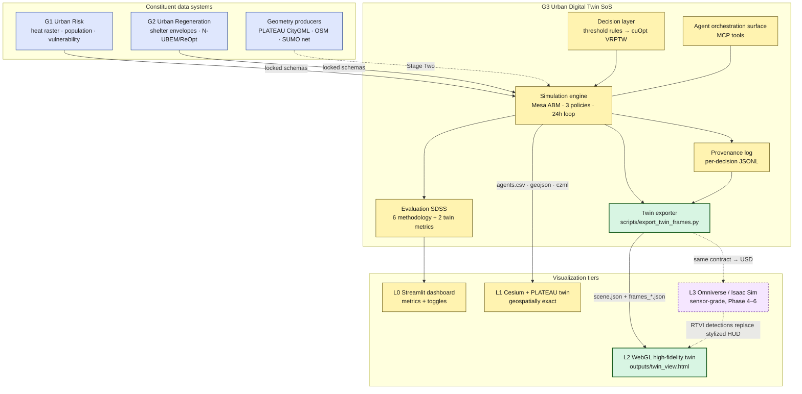
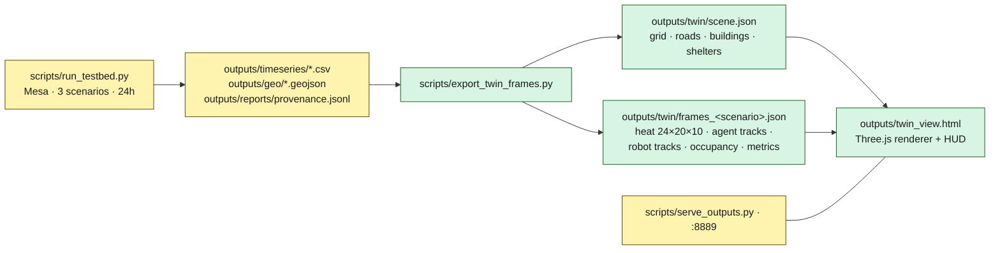

# High-Fidelity Twin Architecture — Urban Heat Risk · Nihonbashi

| | |
|---|---|
| **Revision** | v0.1 — 2026-06-12 |
| **Status** | Proposed (architecture exploration + V1 slice implemented) |
| **Owners** | Sam Duong (orchestration / twin), Yi Tai (ABM + network), Qinghao (heat science), Xilin Tang (design) |
| **Companion docs** | [system_architecture.md](system_architecture.md) · [visualization_plan.md](visualization_plan.md) · [phase4_nvidia_blueprint_plan.md](phase4_nvidia_blueprint_plan.md) · [cuopt_integration_plan.md](cuopt_integration_plan.md) |
| **Decision record** | [decisions/0002-webgl-fidelity-tier.md](decisions/0002-webgl-fidelity-tier.md) |
| **Reference frame** | Mortaheb & Jankowski (2023), *Smart city re-imagined: City planning and GeoAI in the age of big data*, J. Urban Management 12:4–15 |

---

## 1. One-paragraph summary

This document plans the **high-fidelity continuation** of the Nihonbashi digital twin with **urban heat risk as the organizing question**. We keep the Stage One simulation core (Mesa ABM, three policies, six metrics, locked G1/G2 data contracts) and add a new **Tier-2 real-time WebGL twin** — multi-agent street-level animation, day/night cycle, hourly heat-field overlay, and a perception-style detection/track HUD — fed by the exact artifacts the testbed already emits. Testbed (synthetic) data drives it today; every input arrives through a frozen JSON contract so the real Group 1 heat raster, the SUMO network, and PLATEAU-derived geometry drop in without touching the renderer. The tier system deliberately stages us toward the Phase 4–6 Omniverse/Metropolis deployment rather than competing with it.

---

## 2. Framing against the reference paper

Mortaheb & Jankowski argue the smart city should exploit synergies between city planning and GeoAI (Big Data + GIScience + Data Science) to serve four policy goals. We map the twin onto their framework explicitly:

| Paper concept | Where it lands in this project |
|---|---|
| **Real-time GIS digital twin** (§3.3, after Batty 2018; Herrenberg prototype: 3D fabric + mobility + wind-flow sim) | The twin loop: ABM/microsimulation over a 3D urban fabric, rendered in or near real time. Our wind-flow analogue is the **hourly heat-cost field**. |
| **ABM / microsimulation as the simulation technique of real-time GIS** (§3.3) | Mesa ABM today; SUMO co-simulation in Stage Two. |
| **Spatial Decision Support Systems** (§3.4) | The three-policy A/B engine + six-metric comparison **is** an SDSS: scenario design → simulation → multi-metric evaluation. cuOpt dispatch (Stage Two) adds the spatial-optimization arm. |
| **UHI mitigation & microclimate simulation** (§4.3: Zhang et al. green-infrastructure siting; Ladybug/Eddy3D thermal-comfort chains) | Our heat-risk focus. Roadmap V2 upgrades the heat layer from abstract heat-cost to **UTCI/WBGT-labeled** fields; V3 adds a green-infrastructure / shade-siting scenario layer as a second intervention class beside the robot. |
| **Four smart-city policy goals** (§4) | 1) service efficiency → delivery/service-continuity metrics; 2) quality of life → heat-exposure reduction for vulnerable agents; 3) societal/ecological challenges → extreme-heat resilience; 4) knowledge production → provenance log + reproducible A/B runs. |
| **Visualization & communication of big data** (§3.3) | The Tier-2 twin is the stakeholder-facing artifact: it must *read* as a living city, not a chart. |

The paper's caution — technocentrism without planning grounding — is our guardrail: **fidelity is in service of the planning question** (does heat-aware dispatch reduce exposure without raising friction?), not spectacle.

---

## 3. System-of-Systems view

The twin is one constituent in a federation of independently owned systems. Solid boxes run today; dashed are Stage Two / Phase 4+.



SoS properties we maintain:

- **Operational independence** — each tier consumes only published artifacts (CSV/GeoJSON/CZML/JSON); no tier reaches into simulator internals.
- **Managerial independence** — G1/G2 inputs stay behind the schemas locked in `system_architecture.md` §7; the renderer contract (§6 below) is ours and versioned in this repo.
- **Evolutionary development** — tiers upgrade independently: real heat raster lands → only the exporter's loader changes; PLATEAU footprints land → only `scene.json` generation changes.
- **Emergent capability** — the planning answer (exposure ↓ without friction ↑) emerges from sim + decision + evaluation + viz together; no single constituent produces it.

---

## 4. Fidelity model: what "high fidelity" means here

"High fidelity" is not one axis. We track five, and stage them:

| Dimension | L0/L1 today | L2 (this PR) | L2 target (V2–V3) | L3 (Phase 4–6) |
|---|---|---|---|---|
| **Geometric** | PLATEAU LOD2 (L1, exact); 20×10 grid (sim) | Procedural blocks, road grid, shelters | OSM/PLATEAU-derived footprints + SUMO lanes via same contract | USD scene, LOD3, materials |
| **Thermal-physical** | Synthetic heat-cost field [0,2] | Same field, hourly, rendered as ground ramp + thermal mode | G1 raster → UTCI/WBGT bands; building-shadow shade map from computed sun position | Cosmos-Transfer conditioned renders; radiance-level lighting |
| **Behavioral** | 100 agents, hourly cells, threshold policies | Hourly tracks, smooth interpolation, status-driven | Sub-hour SUMO trajectories; pedestrian flows on sidewalk graph | Isaac Sim robot kinematics, crowd sim |
| **Decisional** | Threshold rules, full provenance | Robot fleet animated from real `route/preposition` decisions | cuOpt VRPTW dispatch plans animated per vehicle | Nemotron agent loop + MCP tools live |
| **Visual/perceptual** | Charts (L0); satellite-textured LOD2 (L1) | Day/night cycle, lit facades, streetlights, detection-box/track HUD | Live-streamed frames (WebSocket), camera presets, recording | Path tracing; **real RT-DETR detections** replacing the stylized HUD |

The L2 detection HUD is intentionally shaped like a perception-pipeline output (class, track id, confidence): in Phase 5 the same overlay is driven by real RTVI/Metropolis detections instead of simulation ground truth — the visual language is already in place.

---

## 5. Architecture options explored (L2 renderer)

| Criterion | A. Extend Cesium/PLATEAU | **B. Custom Three.js (chosen)** | C. deck.gl | D. Unity/Unreal WebGPU | E. Omniverse now |
|---|---|---|---|---|---|
| Visual-fidelity ceiling (lighting, day/night, stylization) | Low–mid (globe renderer constraints) | **High** | Mid (data-viz oriented) | Very high | Highest |
| Heat-layer control (custom ramps, thermal mode) | Imagery-layer hacks | **Full shader/canvas control** | Good | Full | Full |
| Smooth multi-agent animation + HUD overlays | CZML interpolation, clunky overlays | **Native (instancing + 2D canvas)** | Good | Native | Native |
| Runs in stakeholder browser, student laptop, offline | Needs PLATEAU/Ion network | **Yes, fully self-contained** | Yes | Heavy toolchain/build | No (GPU/PACE blocked) |
| Geospatial exactness | **Exact (keep as L1)** | Deferred to V2 via geometry export | Good | Manual | Via USD import |
| Authoring cost from current build | Mid | **Low (consumes existing outputs)** | Mid | High | High |
| Path to Phase 4–6 | Weak | **Strong: JSON contract → USD export** | Weak | Divergent | Is Phase 4–6 |

**Decision:** B — a dependency-free Three.js renderer behind a frozen JSON contract, **complementing** (not replacing) the Cesium/PLATEAU tier, which remains the geospatial ground truth. Cesium stays authoritative for "where exactly"; the WebGL tier is authoritative for "what it feels like and what the system is doing." Unity/Unreal would fork the toolchain away from the Python/web stack the team runs; Omniverse remains the L3 target per [phase4_nvidia_blueprint_plan.md](phase4_nvidia_blueprint_plan.md). Full rationale and consequences in [ADR 0002](decisions/0002-webgl-fidelity-tier.md).

---

## 6. Implemented V1 slice (this revision)



**Run it:**

```bash
python scripts/run_testbed.py          # simulation artifacts
python scripts/export_twin_frames.py   # outputs/twin/*.json
python scripts/serve_outputs.py        # CORS server on :8889
# open http://localhost:8889/twin_view.html?scenario=proactive&hour=13
```

**Renderer features (all data-driven):** procedural Nihonbashi-scale blocks (1000 m × 500 m, avenue on the hot pedestrian row y=5); full day/night cycle (sun arc, sky keyframes incl. dusk, emissive windows, streetlights); hourly heat field as ground color ramp + THERM false-color mode; 100 pedestrians (instanced, status-colored: home/activity/**sheltering**/transit) + 6 support robots; detection-box/track-ID/confidence HUD with world-space trails; shelter occupancy labels + capacity bars; scenario switcher, hour scrubber, speed control, auto-orbit.

**Honesty ledger** (sim truth vs. visual dressing — keep this list current):

| Element | Source |
|---|---|
| Agent cell per hour, status, vulnerability | Simulation output (`agents.csv`) — truth |
| Heat field per hour | `heat_field.build_heat_field()` — same array the policies read |
| Shelter occupancy/capacity | Simulation output (geojson) — truth |
| Robot tasks (busy/idle, pickup cells) | Derived from real `route_to_shelter` / `preposition_to_shelter` provenance decisions |
| Robot *paths between* cells, agent in-cell jitter, walking bob | Visual interpolation — not simulated |
| Buildings, roads, streetlights | Procedural placeholder (seeded, deterministic) — replaced by real footprints in V2 |
| Detection boxes/confidences | Stylized from ground truth (confidence = f(vulnerability)) — replaced by real model output in Phase 5 |

---

## 7. Roadmap

| Version | Theme | Work items | Unblocks |
|---|---|---|---|
| **V1 (done)** | Screenshot-grade real-time twin on testbed data | Exporter + renderer + this doc | Stakeholder-facing demo; HUD language for Phase 5 |
| **V2** | Geometric + thermal fidelity | OSM/PLATEAU footprint → `scene.json` (same contract); G1 raster loader → UTCI/WBGT band labels in HUD; building-shadow shade overlay (sun position already computed per hour); SUMO net → road geometry | Real-geometry twin without renderer changes |
| **V3** | Dynamic + decisional fidelity | Sub-hour trajectories (SUMO/`traci` resampling); cuOpt dispatch plan animation (vehicle routes, pickup ETAs); live mode — WebSocket frame stream from a running sim (Kafka-ready per Phase 5 plan); green-infrastructure/shade-siting scenario layer (paper §4.3) as a second intervention | A/B review of real Phase 3 runs in the twin |
| **V4** | Phase 4–6 handoff | `scene.json`/`frames` → USD exporter for Omniverse; swap HUD source to RTVI/RT-DETR detections; Cosmos-Transfer renders for synthetic training data | Blueprint deployment continuity |

Risks: PLATEAU footprint licensing for derived exports (low — open data, attribute it); WebGL perf if agent count scales 10× (mitigate: instancing already in place, cap trails); divergence between L1 and L2 geometry until V2 (accepted, documented here); robot paths are visual until cuOpt lands (flagged in the honesty ledger and the HUD footer).

---

## 8. Relationship to existing docs

- `visualization_plan.md` (Stage One, locked) still governs L0/L1. This doc adds L2/L3 tiers; it does not retire Re:Earth/Streamlit.
- `system_architecture.md` §6 (Stage One vs Stage Two swaps) gains one row: *"viz: + WebGL twin (L2), contract-frozen."* Update at next print revision.
- `phase4_nvidia_blueprint_plan.md` Phase 5 RTVI section is where the HUD swap (stylized → model detections) is executed.
