# Phases 4–6 Plan — NVIDIA Smart City AI Blueprint mapping

| | |
|---|---|
| **Print revision** | v0.2 — 2026-06-01 |
| **Status** | Draft for review |
| **Companion docs** | [methodology.md](methodology.md) · [system_architecture.md](system_architecture.md) · [stage2_data_requirements.md](stage2_data_requirements.md) |
| **References** | [Blueprint Introduction](https://docs.nvidia.com/vss/3.1.0/smartcity-docs/Introduction.html) · [Development Workflow](https://docs.nvidia.com/vss/3.1.0/smartcity-docs/Smartcity-Development-Workflow.html) · [Deep Dive](https://docs.nvidia.com/vss/3.1.0/smartcity-docs/Blueprint-deep-dive.html) · [Prerequisites](https://docs.nvidia.com/vss/3.1.0/smartcity-docs/Prerequisites.html) |

---

## 0. Omniverse ↔ Metropolis — how the two stacks connect

Omniverse builds the **virtual world**; Metropolis (which the Smart City AI Blueprint sits inside) perceives and acts on the **real world**. They are upstream and downstream of each other in our pipeline.

```mermaid
flowchart LR
  classDef omni fill:#76b900,stroke:#2e4a00,color:#0a0a0a,stroke-width:1.5px
  classDef metro fill:#1a73e8,stroke:#062b6f,color:#ffffff,stroke-width:1.5px
  classDef bridge fill:#fff3b0,stroke:#5a4a00,color:#1a1a1a
  classDef real fill:#e8f5e9,stroke:#1b5e20,color:#1a1a1a

  subgraph OMNI[NVIDIA Omniverse · sim-to-real · Phase 4 authoring]
    USD[OpenUSD scene<br/>PLATEAU Chuo-ku LOD2]:::omni
    KIT[Omniverse Kit<br/>RTX path tracing]:::omni
    ISAAC[Isaac Sim + Isaac Lab<br/>robot + sensors + RL]:::omni
    SCEN[Scripted heat scenarios<br/>cool / warm / extreme]:::omni
  end

  subgraph BRIDGE[Bridge · synthetic data generation]
    COSMOS[Cosmos-Transfer 2.5<br/>photoreal upscaling]:::bridge
    LABELS[Auto-labels<br/>pedestrian posture · heat zone]:::bridge
    TAO[TAO Toolkit<br/>fine-tune RT-DETR]:::bridge
  end

  subgraph METRO[NVIDIA Metropolis · real-to-decision · Phase 5-6 deploy]
    RTVI[RTVI microservice<br/>RT-DETR + NvDCF tracker]:::metro
    BA[Behavior Analytics<br/>custom heat anomalies]:::metro
    VLM[Cosmos Reason 2 8B<br/>alert verification]:::metro
    AGENT[Nemotron Nano 9B v2<br/>MCP agent + tools]:::metro
    DASH[Operator dashboard<br/>PLATEAU 2D + Cesium 3D]:::metro
  end

  subgraph REAL[Nihonbashi · real-world deployment]
    CAMS[Camera mesh + IoT<br/>thermal · pedestrian]:::real
    ROBOT[Heat-Support Robot<br/>physical fleet]:::real
  end

  USD --> KIT --> SCEN
  ISAAC --> SCEN
  SCEN --> COSMOS --> LABELS --> TAO
  TAO --> RTVI
  CAMS --> RTVI --> BA --> VLM --> AGENT --> DASH
  AGENT --> ROBOT
  ROBOT --> CAMS
```

**Rule of thumb:** if it has a USD file or runs on a workstation GPU, it's Omniverse. If it has a camera feed or runs as a Docker Compose service, it's Metropolis. The Smart City AI Blueprint is a curated Metropolis reference application.

---

## 1. Why the Blueprint

The NVIDIA Smart City AI Blueprint (VSS 3.1.0) is the production substrate that maps cleanly onto our planned Phases 5–6 deployment. Adopting it avoids building from scratch:

- A camera-driven realtime perception stack (RTVI + NvDCF tracker)
- A VLM alert-verification loop (Cosmos Reason 2 8B)
- An LLM agent layer (Nemotron Nano 9B v2 + MCP tools)
- A 2D city-map + dashboard for ops
- Kafka/Redis/ELK message + storage backbone

**Architectural fit ≈ 70%.** Domain divergence (~30%) is in the anomaly catalog: the Blueprint ships with vehicle anomalies (collision / stalling / wrong-way); we need pedestrian-heat anomalies. These need custom Behavior Analytics rules and Cosmos Reason 2 prompts. The Mesa ABM testbed in `sim/testbed/` stays as the **upstream policy-design sandbox** — the Blueprint runs *operational* anomaly detection, not counterfactual A/B simulation.

---

## 2. Phase-by-phase mapping

| Workshop phase | Blueprint stage | Our existing artifact | Gap to close |
|---|---|---|---|
| 4 — AI + CAD optimization | **Simulate** (CARLA + Cosmos-Transfer 2.5) + **Train** (TAO) | Mesa testbed produces variable matrix + policy traces; CAD work in `design/` | Author Omniverse/Isaac Sim scenarios anchored on PLATEAU Chuo-ku; render with Cosmos-Transfer; fine-tune RT-DETR for pedestrian + heat-stress posture |
| 5 — ABM re-simulation verification | **Deploy** (RTVI + Behavior Analytics + Alert Verification) | `sim/testbed/policy.py` + `analysis/dashboard.py` | Port policies (`baseline` / `reactive` / `proactive`) into Blueprint anomaly definitions; wire Cosmos Reason 2 to verify heat-stress alerts |
| 6 — High-fidelity scene + validation | **Deploy** (Agents + Dashboard) on real cameras | `outputs/cesium_view.html` (PLATEAU 3D Tiles + CZML) | Replace local CORS server with VIOS + Kafka; replace iframe with Blueprint deploy dashboard; keep our PLATEAU twin as the 2D/3D map |

---

## 3. Microservice mapping (Blueprint → our codebase)

| Blueprint microservice | Role | Our equivalent today | Migration step |
|---|---|---|---|
| **RTVI** (Realtime Video Intelligence) | RTSP ingest → object detection (RT-DETR / Mask-Grounding DINO) → NvDCF tracking → nvschema metadata | None (we use synthetic agent profiles) | New: deploy RTVI against Nihonbashi camera mesh; fine-tune detector on Cosmos-Transfer synthetic pedestrians under heat conditions |
| **Behavior Analytics** | Spatio-temporal anomaly detection (collision / stall / wrong-way ship default) | `sim/testbed/policy.py` (`baseline` / `reactive` / `proactive`) | Author custom anomalies: `heat_exposure_exceedance`, `shelter_capacity_breach`, `vulnerable_agent_isolation` (mobility ∈ {assisted, restricted} ∧ heat > threshold) |
| **Alert Verification** | Cosmos Reason 2 8B VLM on 15 s video snippets to confirm anomaly | Provenance JSONL `decision_auditability` metric | Author prompt templates per anomaly type (e.g. "is this person showing heat-stress posture and outside cooled space?") |
| **VIOS** (Video IO & Storage) | RTSP discovery, ingestion, replay, ≤ 1 TB recording | `scripts/serve_outputs.py` (static CORS server on :8889) | Replace with VIOS; keep `outputs/cesium_view.html` as a Cesium overlay consumer |
| **Agents** | Nemotron Nano 9B v2 + MCP clients for NL queries, reports, sensor ops | Hand-coded policy + Streamlit dashboard tabs | Wrap `policy.proactive(profile, hour, world)` as an MCP tool; expose `compute_metrics(scenario)`, `route_to_shelter(agent_id)`, `query_hourly_exposure(cell, hour)` |
| **Message Broker** (Kafka + Redis) | Inter-service metadata + caching | `outputs/reports/provenance.jsonl` | Migrate JSONL emitter → Kafka producer; preserve provenance schema |
| **API Gateway / MCP** | Video Analytics API + MCP server | None | New: stand up MCP server for the Agent layer to consume our metrics + policies |
| **Database (ELK)** | Persistence + dashboards | `outputs/timeseries/*.csv` (regenerated each run) | Move metrics tables into Elasticsearch; build Kibana mirrors of the Streamlit charts |

---

## 4. Hardware and platform plan

### What the Blueprint requires (per [prerequisites](https://docs.nvidia.com/vss/3.1.0/smartcity-docs/Prerequisites.html))

| Resource | Required |
|---|---|
| GPU (validated) | H100 / L40S / RTX PRO 6000 Blackwell |
| CPU | 18-core x86-64 |
| RAM | 128 GB |
| Storage | 1 TB SSD |
| OS | Ubuntu 24.04 |
| Driver / Docker / Compose / NVCT | 580.105.08 / 27.2+ / v2.29+ / 1.17.8 |
| Keys | NGC API + Google Maps API |

**RTX 4090 (24 GB, consumer Ada) is not on the validated list.** Sufficient for Omniverse + Isaac Sim *authoring* and small-scale POC, **not** for the Blueprint deploy stack.

### Allocation across resources

| Workload | Best platform | Why |
|---|---|---|
| **Phase 4 — TAO fine-tuning, Cosmos-Transfer rendering** | **PACE Phoenix** (H100 / H200 nodes via SLURM) | Batch, Apptainer-friendly. PACE GPU hours are workshop-fundable. |
| **Phase 5–6 — Blueprint deploy stack (RTVI + Kafka + agents + dashboard)** | **NVIDIA LaunchPad / Brev** or **cloud-burst L40S** (Lambda / RunPod) | Long-running Docker Compose stack with inbound network — incompatible with PACE shared compute. LaunchPad has a Smart City "Launchable" pre-configured. |
| **Local dev — Mesa testbed + Streamlit + Omniverse authoring** | RTX 4090 workstation | Already in plan. Stage One runs on CPU; Phase 4 authoring in Omniverse uses the 4090. |

### PACE caveats

- ❌ Docker daemon not permitted on PACE compute. Blueprint ships as Docker Compose. Translating ~8 microservices + Kafka + Redis + ELK to Apptainer is non-trivial; **don't try for the deploy leg**.
- ✅ Apptainer + SLURM is excellent for TAO training and Cosmos-Transfer render jobs.
- ⚠️ PACE compute nodes run RHEL/Rocky, not Ubuntu 24.04. Containers abstract the host OS, so this is workable but unsupported by NVIDIA reference.
- ⚠️ Inbound network ports (Kafka 9092, dashboard 8501, etc.) are not exposed externally on PACE; not suitable for hosting a live operator dashboard.

---

## 5. Adapted anomaly catalog (Nihonbashi vs. Raleigh)

Raleigh's canonical use case is real-time traffic-incident alerts. Nihonbashi substitution table:

| Raleigh signal | Nihonbashi signal | Source |
|---|---|---|
| Vehicle collision | **Heat-stress collapse posture** detected on pedestrian | RTVI + Cosmos Reason 2 prompt |
| Vehicle stalling | **Vulnerable agent stationary in heat-exposed cell** (cell heat > threshold AND status ∉ sheltering AND mobility ∈ {assisted, restricted}) | Behavior Analytics custom rule |
| Wrong-way driving | **Shelter capacity breach** (live occupants > max_occupants) | Behavior Analytics on VIOS occupancy stream |
| (n/a) | **Cooling-gap residual** — predicted exposure for next 4 hours exceeds policy threshold and no proactive route assigned | Custom rule using `proactive` lookahead |

---

## 6. Sequencing (concrete next steps after Stage One)

| When | Deliverable | Owner |
|---|---|---|
| Pre-workshop | Submit PACE allocation request for Phase 4 training (H100 hours, ~500 GPU-h estimate) | Sam |
| Pre-workshop | Apply for NVIDIA LaunchPad academic access (Smart City Blueprint Launchable) | Sam |
| Workshop week 1 | Author 3 Omniverse Nihonbashi scenarios anchored on PLATEAU Chuo-ku (cool / warm / extreme heat) | Xilin + Sam |
| Workshop week 2 | Render with Cosmos-Transfer 2.5; produce ~10 k pedestrian-frame training set with thermal-stress posture labels | PACE batch |
| Workshop week 3 | TAO fine-tune RT-DETR; deploy first Blueprint instance on LaunchPad against fine-tuned model + synthetic RTSP from Omniverse | Sam |
| Workshop week 4 | Wrap `policy.proactive` as MCP tool; agent demo: "preposition robots to highest-vulnerability cells before 14:00 peak" | Sam + Yi |
| Post-workshop | Stage real cameras + thermal IoT mesh in Nihonbashi pilot; cut over from synthetic RTSP to real streams | Field team |

---

## 7. What is explicitly **out of scope** for the Blueprint adoption

- **Mesa ABM testbed in `sim/testbed/`** — keep as policy-design sandbox; not migrated to Blueprint. Two layers of the stack: ABM = policy design, Blueprint = realtime ops.
- **Folium / static maps in `analysis/`** — already superseded by `analysis/dashboard.py` Streamlit + Cesium view.
- **SUMO traffic micro-sim** — Yi Tai's track; not part of Blueprint flow, runs alongside.

---

## 8. Phase 1-3 standing and post-demo plan

The Streamlit + Cesium demo is a runnable **end-to-end skeleton**, not finished Phase 1-3 work. Honest status per phase:

| Phase | Deliverable | Status | Gap |
|---|---|---|---|
| 1 | `data/robot_params/starship_baseline.csv` (Starship parameter abstraction) | ✅ done | — |
| 1 | 200 m Nihonbashi SUMO scene at `sim/sumo/nihonbashi_200m/` | ❌ not built | Yi Tai owns; needs OSM clip + SUMO net + heat-cost edge attributes |
| 1 | 600+ baseline runs (4 heat × 3 traffic × ≥50 replicates) at `sim/runs/phase1_baseline/` | ❌ not run | Blocked on SUMO scene |
| 1 | Ranked friction-point list at `docs/phase1_friction_points.md` | ❌ not generated | Auto-generated from runs; blocked on previous |
| 1 | Real heat-risk layer from parent Tokyo Studio Random Forest classifier | ❌ synthetic stand-in | Pull from parent repo per `phase1_baseline.md` §4 |
| 2 | `data/robot_params/variable_matrix.csv` — proposal_v1 column | ✅ done (17 rows) | proposal_v2 / v3 columns empty |
| 2 | Concept renders at `design/concept/` | ❌ empty | Xilin owns |
| 2 | CAD models at `design/cad/` | ❌ empty | Xilin owns; gated on Phase 4 |
| 3 | A/B simulation across baseline / reactive / proactive (six metrics) | ✅ runs in Mesa testbed | Mesa-only — SUMO traffic layer not joined |
| 3 | Iterative loop back to Phase 2 (residuals → v2 design) | ❌ not closed | Need at least one full iteration to declare Phase 3 done |

**Honest read:** the demo proves the **pipeline works** with synthetic data. The **research result** (does the proposed robot reduce heat exposure in *real* Nihonbashi data) is still pending. Phase 1-3 are ~40-50% complete on the *deliverable* axis, even though the *infrastructure* is 100% done.

### Post-demo plan — three tracks running in parallel

**Track A · Close Phase 1-3 with real data** (Sam + Yi + Qinghao, 2-3 weeks)

1. Pull Qinghao's hourly heat-cost raster from the parent Tokyo Studio repo; swap `sim/testbed/heat_field.py` to load it (schema is locked in `system_architecture.md` §7a, no code change needed beyond the loader).
2. Yi builds the 200 m SUMO scene at `sim/sumo/nihonbashi_200m/`; bridge SUMO ↔ Mesa testbed.
3. Run the 600+ replicate baseline; auto-generate `docs/phase1_friction_points.md`.
4. Murugesan's N-UBEM cooling envelope → `sim/testbed/shelter_model.py` (same locked schema).
5. One iteration of the loop: feed friction points into Phase 2; Xilin produces proposal_v2 column + concept renders; re-run Phase 3.

**Track B · Phase 4 setup in parallel** (Sam, 1-2 weeks)

1. PACE Phoenix allocation application (H100 hours, ~500 GPU-h).
2. NVIDIA LaunchPad academic access for Smart City Blueprint Launchable.
3. Author 3 Omniverse Nihonbashi scenes (cool / warm / extreme) anchored on PLATEAU Chuo-ku; do not wait for Phase 1-3 finalization.

**Track C · Demo polish for stakeholder reviews** (Sam, 1 week, lightweight)

1. README + system_architecture diagram pass (this PR).
2. Pre-record a 3-min demo video showing Streamlit dashboard + Cesium playback walk-through; embed in the proposal deck.
3. Lock the Stage One review date with Perry's team.

### Decision gate before Phase 4 starts in earnest

Don't fire Phase 4 GPU hours until **at least one closed Phase 1→2→3 iteration with real data** lands. Without that, Phase 4 (AI + CAD optimization) has nothing meaningful to optimize against — you'd be retraining a CV model on a robot design that hasn't been validated against real Nihonbashi behavior yet.

---

## 9. Decision log

- **2026-06-01** — Reviewed VSS 3.1.0 Smart City Blueprint docs. Decision: adopt as Phase 5–6 substrate, not Phase 4. PACE for training; LaunchPad/cloud for deploy. RTX 4090 plan downgraded to Omniverse authoring only. (Rationale: Blueprint validated GPUs are H100/L40S/RTX PRO 6000; PACE forbids Docker.)
- **2026-06-01** — Added Omniverse ↔ Metropolis diagram and Phase 1-3 honest status table. Decision gate set: do not fire Phase 4 GPU hours until one closed Phase 1→2→3 iteration with real data lands.
