# From Georeferenced Digital Twin to Omniverse: What Fidelity Does a Block-Scale Urban Energy Decision Actually Require?

*A calibration and fidelity-evaluation study of an energy, heat, and mobility twin of Nihonbashi, Tokyo*

Sam Duong · Advisor: Dr. Perry Yang, Georgia Institute of Technology

## Abstract

This study asks whether per-building energy use intensity and mobility-derived occupancy change the cost-optimal sizing of distributed solar and battery storage for a block in Nihonbashi, Tokyo. The comparison is against the flat archetype and pro-rata assumptions the twin previously carried, at building scale and at block scale. The study is built on a browser-deployable digital twin of 22 buildings that co-locates building geometry, retrofit parameters, a district supply optimization, a heat-cost field, and pedestrian mobility ping data in one georeferenced scene. Diagnostic work for this document produced a preliminary result that reframes the project. The per-building energy values in the twin were not a model output: they were a single district total divided pro rata by floor area. Of that district total, 48.1% is electric vehicle and bus charging rather than building load. Real per-building intensities exist in the studio's Nihonbashi Urban Building Energy Model and were unused. Correcting this is the first stage of the work.

The second stage reframes the fidelity ladder, which runs from an analytical dashboard through a web-based digital twin to a game-engine or Omniverse simulation tier, as an evaluation framework rather than a migration roadmap. The study reports, for each of three urban design decisions, the lowest fidelity tier at which the decision stops changing. One of those decisions requires the simulation tier, whose GPU access is not yet secured, so that tier may be reported as unexecuted, with an argument for what it would have added. Two of four materiality thresholds are already crossed at building scale on the corrected demand layer alone.

**Keywords:** urban digital twin; building energy; retrofit; PV and storage sizing; occupancy; fidelity; Nihonbashi

---

## 1. Introduction

Urban digital twins are increasingly proposed as the medium in which district decarbonization decisions are made. The proposition is that co-locating building energy demand, renewable supply, microclimate, and human activity in one georeferenced scene lets a designer or a district operator see the consequences of a decision before making it. What that proposition rarely states is how much representational fidelity a given decision requires, or whether the numbers carried inside the scene can survive an audit.

This study addresses both gaps for one block in Nihonbashi, Tokyo. It is a companion to the Tokyo Smart City Studio's district-scale work on Nihonbashi District 2 (Tokyo Studio Group 1, 2026). That work develops activity-informed occupancy analytics, an enhanced Nihonbashi Urban Building Energy Model (N-UBEM), smart-grid optimization, and financial feasibility analysis. That study asks which carbon neutrality pathways are available to the district. This study asks a narrower and more skeptical question about the same evidence base: whether the representational choices made when those pathways are placed inside a twin change the decisions the twin is meant to support.

An earlier framing of this project claimed novelty by conjunction: first to combine archetype building energy modeling, supply optimization, a heat field, and mobility-derived occupancy in one georeferenced scene. That framing does not survive review. Combining four existing things is integration work rather than a research contribution. Three claims are defensible in its place.

1. **A reproducible dataset-coupling and reconciliation method.** The diagnostic in Section 5 is the evidence. The substantive work is reconciling six heterogeneous studio artifacts into a single per-building record with stated units, one that passes consistency assertions. Most district twin papers assert this step; almost none audit it.

2. **A calibration of occupancy from mobility pings, with its failure mode characterized.** The ping-derived schedules are usable for shape, not magnitude. Two of the 22 study buildings, and approximately 24 of the 136 buildings with data in the parent dataset, show a night-over-day inversion attributable to overnight dwell bias. Documenting when this data source fails is more useful than claiming it works.

3. **A fidelity evaluation framework.** Section 4 reframes the L1 to L3 ladder as an experiment: for a given decision, does the answer change when a tier is added? This is the part that generalizes beyond Nihonbashi.

The system is at present mostly co-location. Several layers share a coordinate frame and a view, but information does not flow between them. The research work is to close one loop end to end:

> retrofit scenario (WWR and R-value change) → building cooling load change → anthropogenic heat rejected to the street canyon → street-level heat cost field → pedestrian and delivery-robot route choice and exposure

Today, steps 1 and 2 exist as spreadsheet columns, step 4 exists as a precomputed field, and step 5 exists as a Mesa agent testbed. Steps 2 to 3 and 3 to 4 are not connected. Closing them is what remains to be built. Until it is closed, the twin is a coordinated set of views, not a coupled model.

---

## 2. Case Study and Problem Framing

Nihonbashi is one of Tokyo's historically significant commercial districts, with a heterogeneous stock of offices, retail, services, and mixed residential buildings under active redevelopment pressure. The studio's district-scale work takes Nihonbashi District 2 as its system boundary, covering approximately 100 to 200 buildings. Of those, 171 carry facade attributes derived from street-view imagery, and 22 are simulated in three retrofit scenarios (Tokyo Studio Group 1, 2026).

This study takes those same 22 simulated buildings as its block-scale case. The block measures approximately 95 by 108 m and contains 25,731 m² of gross floor area on 4,128 m² of footprint, a mean of 6.2 floors per building. Working at this scale allows every representational choice to be traced to a named building, which is what makes the audit in Section 5 possible. It also fixes the limits of the study: 22 buildings is a case, not a sample.

The data landscape for the block is unusually rich and unusually heterogeneous. Six families of artifact arrived from four modeling traditions (Table 1).

| Source family | Artifact | What it carries |
|---|---|---|
| Retrofit parameters | `Index_energy.xlsx`, sheets baseline, s1, s2 | Per-building window-to-wall ratio, R-value, and simulated EUI for three scenarios |
| Simulated building loads | `Nihonbashi_District/`, 22 hourly workbooks | 8760-hour demand per building, summing to 655,461 kWh/yr |
| Supply optimization | `TS_ND_1_..._results.json` | A REopt run: 417 kW PV, 100 kW / 783 kWh storage, 39.8% onsite renewable fraction |
| Vehicle charging demand | `annual_total_car_bus_energy_8760h.csv` | 8760-hour EV and bus charging series, 608,552 kWh/yr |
| Mobility traces | `pings_in_area_6677.geojson` | 25,254 GPS pings from 812 devices, EPSG:6677 |
| City geometry | PLATEAU LOD2, `tokyo_bldg_smaller_block.geojson` | Footprints, heights, floor counts, and a georeferenced LOD2 city mesh |

**Table 1:** Source families and artifacts assembled for the study block.

The gap this study addresses is what happens between those artifacts and the twin. Each artifact is defensible on its own terms. The join between them is where units, denominators, temporal bases, and attribution boundaries are silently decided. It is also where a twin can present a confident surface over a number that no longer means what its label says.

---

## 3. Research Objective and Questions

The core objective is to determine, for a block-scale urban energy decision, the lowest representational fidelity at which the recommended action stops changing, and to establish the data conditions under which that determination is meaningful. The second half of that objective is not decoration. A fidelity comparison run on a data layer that carries a pro-rata artifact would compare rendering styles, not decisions.

### 3.1 Primary question

> **Does per-building energy use intensity from the studio's N-UBEM, combined with ping-derived occupancy schedules, materially change the cost-optimal PV and battery sizing for a Nihonbashi block? The reference case is the flat pro-rata and flat-schedule assumptions previously embedded in the twin.**

"Materially" is defined in advance so the question can fail (Table 2).

| Criterion | Threshold for "yes, it matters" |
|---|---|
| Block-scale PV sizing | Cost-optimal PV capacity changes by more than 10% from the current 417 kW |
| Block-scale storage sizing | Cost-optimal storage energy changes by more than 10% from the current 783 kWh |
| Building-scale ranking | The rank order of the 22 buildings changes for more than 5 buildings, or the Spearman rank correlation against the GFA ordering, which the pro-rata construction reproduces exactly, falls below 0.9 |
| Retrofit priority | The top 5 retrofit candidates by absolute annual savings change by at least 2 members |

**Table 2:** Materiality thresholds defined in advance for the primary question.

If none of these thresholds is crossed, the answer is "no", and the negative result is publishable: at block scale, a pro-rata split would be a defensible approximation for supply sizing.

### 3.2 Secondary question

> **At which fidelity tier does the answer to a given urban energy decision stop changing?**

For each of the three design decisions in Section 3.3, the study reports the lowest tier in the L1 to L3 ladder (Section 4) at which the recommended action is stable. The tiers are the analytical dashboard and basic views (L1), the web-based digital twin (L2), and the game-engine or Omniverse simulation tier (L3). The deliverable is a decision-by-tier matrix, not a claim that higher fidelity is better.

### 3.3 Sub-questions and decisions

The test of an urban twin is whether a designer or a district manager would act differently after looking at it. Three decisions frame the sub-questions (Table 3): which buildings to retrofit first (D-1), how much solar and storage the block should procure (D-2), and whether the retrofit and electrification program makes the street warmer or cooler for pedestrians and delivery robots (D-3).

| Sub-question | Purpose |
|---|---|
| RQ1. Does replacing a pro-rata energy split with per-building N-UBEM intensity change which of the 22 buildings should be retrofitted first (D-1)? | Establish whether building-scale retrofit priority is sensitive to the demand representation, and quantify the change in rank order and in the top-5 candidate set. |
| RQ2. Does correcting per-building demand and separating vehicle charging change the cost-optimal PV and storage the block should procure (D-2)? | Connect the corrected demand layer to district energy infrastructure sizing and test it against the materiality thresholds in Section 3.1. |
| RQ3. Can GPS-derived occupancy be used as a demand-shaping input, and where does it fail? | Characterize the usable envelope of mobility-derived schedules, including the inversion and imputation failure modes, before they enter a supply calculation. |
| RQ4. At which fidelity tier does each decision stop changing? | Produce the decision-by-tier matrix that converts the fidelity ladder from a migration roadmap into a measurable experiment. |
| RQ5. Once the web tier is photoreal, what remains for a simulation tier to justify (D-3)? | Separate appearance fidelity from simulation fidelity and state what street-level heat and agent-routing questions require that a browser cannot supply. |

**Table 3:** Sub-questions and their purpose.

Decisions D-1 and D-2 are answerable with the Stage A work in Section 6. D-3 requires the closed loop named in Section 1 and is scoped as outlook.

### 3.4 What this study does not claim

This study does not claim a validated building energy model. There is no metered kWh ground truth for the 22 buildings available to this author, and the N-UBEM calibration reported by the studio is not independently reproduced here. It does not claim that agentic or LLM-driven scenario exploration is novel; two 2026 papers already do that (Section 4.3). It does not claim a real-time or operational twin.

---

## 4. Conceptual Framework

The framework is organized around one contract rather than a set of connected modules. Six source families are reconciled into a single per-building record, and every fidelity tier reads that record without recomputing energy. The verification checks of Section 5.12 sit between the reconciliation and the record, so a tier can only ever read numbers that passed them.

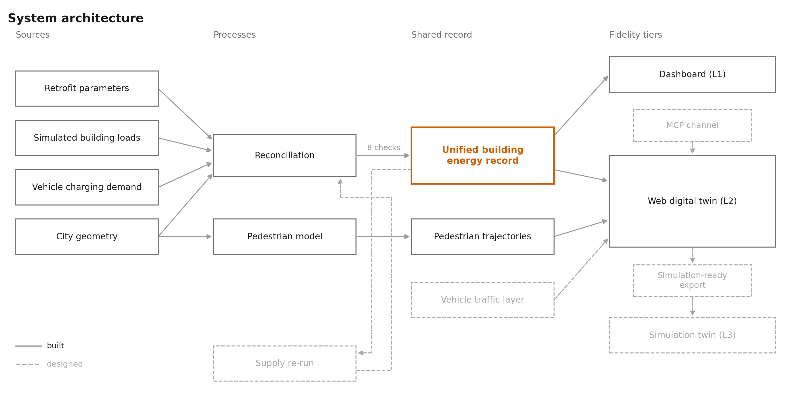

**Figure 1. System architecture of the Nihonbashi block twin.** Sources, processes, the shared record, and the fidelity tiers that read it. The unified building energy record is the single contract: every tier reads it and none recomputes energy. Reconciliation writes it only after the eight verification checks V1 to V8 pass. Fidelity tiers: L1 the analytical dashboard and basic views, L2 the photoreal web digital twin running today, L3 the game-engine or Omniverse simulation tier, reached through a simulation-ready USD export that is in progress. Solid = built and running in this repository; dashed = designed and not claimed as a result, namely the vehicle traffic layer, the simulation-ready export and the L3 tier, the supply re-run on the corrected load, and the MCP channel into the twin.

### 4.1 The fidelity ladder as an evaluation framework

The ladder below is not a migration plan. It is the independent variable of the secondary research question. Each tier is a level of representational fidelity (Table 4), and the experiment asks, for each decision in Section 3.3, whether moving up a tier changes the recommended action.

| Tier | Representation | Physics and behavior | Cost to build | Decisions it can plausibly settle |
|---|---|---|---|---|
| **L1** | Analytical dashboard and basic views. Per-building records, charts, the Streamlit dashboard, and the basic Cesium and three.js views. | None. Annual and monthly aggregates. | Days. Built. | D-1 retrofit priority; block-total supply sizing |
| **L2** | Web-based digital twin. CesiumJS on real terrain and photoreal tiles, the 22 study buildings, hourly scrubbing, scenario toggles, agent overlay. Running today. | Precomputed fields. No solver in the loop. | Weeks. Already paid. | D-2 with spatial context; communication and stakeholder review; shading and adjacency screening |
| **L3** | Simulation tier. Game engine or Omniverse. Physically based rendering, ray-traced or simulated solar and thermal exchange, agent physics, sensor simulation. | Simulation in the loop. Robot policies, pedestrian agents, radiative exchange. | Months. Requires GPU access not yet secured. | D-3 street-level heat exposure; robot and pedestrian routing under physical constraints |

**Table 4:** The L1 to L3 fidelity ladder as the independent variable of the fidelity experiment.

The simulation-ready USD export is not a tier of this ladder. It is the bridge artifact on the L2 to L3 path: the interchange format in which the L2 scene is handed to whichever L3 runtime access materializes.

### 4.2 What the photoreal base does and does not settle

The web twin now streams Google Photorealistic 3D Tiles as its full base, overlaying the 22 study buildings on a photogrammetric mesh of the surrounding city. This raises the appearance fidelity of the web tier to the level usually associated with game-engine captures, at zero simulation cost. It also clarifies what appearance fidelity is not.

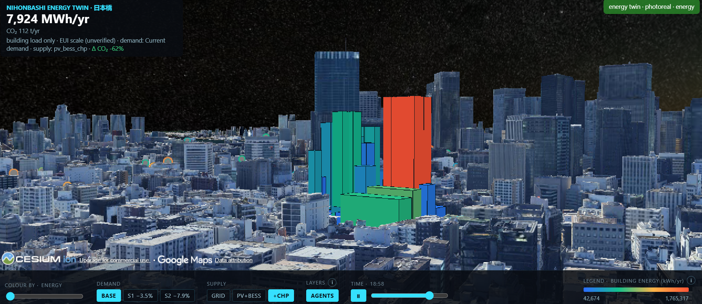

**Figure 2. The baked-lighting limit of a photogrammetric base.** The same scene at a night simulation time. The sky darkens and the study buildings respond, but the city around them stays in the daylight baked into the tiles at capture time. The Google mesh carries a fixed sun position, frozen vehicles and vegetation, no per-building identity outside the study block, and no physics. Basemap: Google Photorealistic 3D Tiles, © Google.

The photoreal base therefore sharpens the evaluation question of the higher tier rather than answering it. What a game-engine or Omniverse tier must justify is not visual realism, which the web tier already demonstrates in a browser, but simulation fidelity: semantic structure, controllable lighting and weather, collision and sensor physics for agent simulation, and synthetic data generation.

The hypothesis, to be tested rather than assumed, is that D-1 settles at L1 or L2, D-2 settles at L2, and only D-3 requires L3. If that is what the study finds, the finding is "most district energy decisions do not require a game engine", which is more useful to the field than a migration success story.

### 4.3 Platform paths and positioning

Two credible paths exist to the L3 tier. The project commits to whichever access materializes first and reports the choice as a constraint rather than a preference. The NVIDIA Omniverse and Isaac Sim path aligns with an industry reference architecture and supplies physically simulated robot policies and sensor models. It requires an RTX-class GPU allocation that does not exist and has not been requested. The official PLATEAU Unity and Unreal SDKs run on consumer hardware and ingest CityGML with its coordinate reference system intact, at the cost of weaker robot physics. Georeferencing must be solved by the author on the Omniverse path, since USD carries no geodetic frame, and is solved by the SDK on the PLATEAU path.

At the simulation tier, Omniverse Kit provides the USD-native runtime and composition layer, with Isaac Sim supplying robot physics (NVIDIA, 2025). NVIDIA's demonstrated Model Context Protocol (MCP) integration for Omniverse Kit is noted as a candidate control channel. The natural-language scenario interface planned for Stage B could drive an Omniverse scene through the same protocol, which would make that layer view-agnostic rather than tied to either tier. This is recorded as a design direction, not a committed dependency; it activates only if GPU access materializes. The USD exporter work is platform-agnostic in either case: USD is the interchange format for the Omniverse path and imports, with effort, into Unity and Unreal.

The July 2026 literature scan shows where not to compete (Table 5).

| Thread | Representative work | Implication for this study |
|---|---|---|
| Agentic and LLM-driven urban twins | Ye et al. (2026); Xu et al. (2026) | **Commoditized.** Two papers already do LLM agents over urban twins. An agentic layer here is a convenience feature and must not be the headline |
| District-scale energy twins | Paule et al. (2026), review | Confirms the domain is active. The review's own critique, that most work treats demand or supply but rarely both on the same buildings, is where this integration sits; integration alone is not enough |
| Urban heat twins | Hossain et al. (2026) | Establishes heat as a twin-worthy variable. None of this work couples the heat field back to building retrofit decisions, which is the loop named in Section 1 |
| Pedestrian agents in twins | Lin and Wang (2026), SenseWalk | Pedestrian agents exist but are not coupled to energy or heat. The D-3 decision is open |
| Industry reference stack | NVIDIA (2025) | Establishes SimReady city twins plus synthetic data plus AI agents as an industry architecture. Academic evaluation of what that tier adds over a web twin is scarce, which is the secondary question here |

**Table 5:** July 2026 literature scan and its implication for this study.

The defensible edge is the dataset coupling and its audit, the occupancy calibration with characterized failure modes, and the fidelity evaluation. Not the agent layer.

---

## 5. Data and Diagnostic Audit

This section is the study's methodological contribution at the data layer. Where the studio's Stage 1 builds an empirical occupancy foundation, this audit establishes whether the artifacts assembled across all stages survive being joined. All numbers below were computed from repository files and are reproducible. The audit examined the data layer as it stood before the July 27 correction pass, and Section 6 records the rule adopted in response.

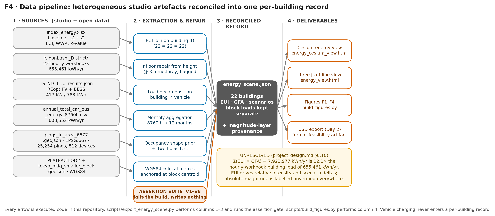

**Figure 3. The reconciliation pipeline.** Six source families, one extraction or repair step each, reconciled into a single per-building record behind the eight verification checks V1 to V8. A failing check fails the build and writes nothing. The unified record is `outputs/energy/energy_scene.json`. Columns 1 to 3 are performed by `scripts/export_energy_scene.py` and column 4 by `scripts/build_figures.py`. Vehicle charging never enters a per-building record. Solid = built, dashed = designed and not yet executed.

### 5.1 Per-building energy in the twin was a pro-rata split

Every one of the 22 buildings in `data/energy/energy_dataset.json` satisfies

```
annual_energy_kwh = gfa_m2 × 49.92954090210394
```

exactly. The relative spread of that ratio across the 22 buildings is 1.4 × 10⁻¹⁴, which is floating-point noise. The constant is not arbitrary:

```
1,264,013 kWh ÷ 25,315.9347585096 m² = 49.92954090210394 kWh/m²
```

The numerator is `ElectricLoad.annual_calculated_kwh` from the REopt results file, which is 1,264,013.09 kWh, rounded to the whole kWh before the division. Dividing the unrounded value instead gives 49.9295444572, so the rounding step is part of the reconstruction. The denominator is the block's total gross floor area as published. One district total was divided by total floor area and multiplied back out per building. Every building therefore carried an identical energy intensity, and the twin's energy intensity layer carried no information.

### 5.2 Half of the district total is vehicle charging

The REopt total decomposes with no residual (Table 6).

| Component | Annual kWh | Share |
|---|---|---|
| District building load (sum of the 22 `Nihonbashi_District` hourly workbooks) | 655,461.23 | 51.9% |
| EV and bus charging (`annual_total_car_bus_energy_8760h.csv`) | 608,551.86 | 48.1% |
| **Total (= REopt `annual_calculated_kwh`)** | **1,264,013.09** | 100% |

**Table 6:** Decomposition of the REopt district total into building load and vehicle charging.

The sum is exact. So 48.1% of what the twin attributed to building energy is transport charging. Any per-building energy figure or CO2 attribution derived from this total is inflated by approximately a factor of two. The split was also uniform across buildings, regardless of whether a building has any charging infrastructure.

### 5.3 The per-building intensities are N-UBEM outputs, and they were unused

`data/energy/Index_energy.xlsx` has three sheets, `baseline`, `s1`, and `s2`, each with an `EUI` column at zero-based index 10. Before the correction pass, the scene builder read only the window ratio and R-value columns from those sheets, and a repository-wide search found zero code references to the EUI column. The building ID sets in `Index_energy.xlsx` and `energy_dataset.json` are identical, 22 IDs in each with no difference in either direction, so the join was available directly.

These EUIs are not measurements. They are outputs of the studio's enhanced N-UBEM: a Rhino and Grasshopper workflow using Ladybug and Honeybee on an LOD1 model, with street-view-derived window-to-wall ratios and manually classified facade materials. The studio reports calibrating that model against measured energy data provided by Japanese stakeholders (Tokyo Studio Group 1, 2026). Reading the sheets against that report cross-validates the join at the building level. The values agree wherever the two documents overlap (Table 7).

| Building | Reported by the studio | Value in `Index_energy.xlsx` |
|---|---|---|
| 3550 | EUI 331.219 → 313.793 under S1, a 5.26% reduction | 331.219 → 313.793, 5.26% |
| 4050 | EUI 283.312 → 268.736 under S1, a 5.15% reduction | 283.312 → 268.736, 5.14% |
| 3552 | 0.65% reduction under S1 | 0.65% |
| 2070 | EUI 409.831 → 349.354 under S2, a 14.76% reduction | 409.831 → 349.354, 14.76% |
| 3067 | 12.19% reduction under S2 | 12.19% |
| 4571 | 11.54% reduction under S2 | 11.54% |
| 2563 | Almost no change under S2 | 0.00% |
| All 22 | Mean EUI 407.0 baseline, 397.0 under S1, 377.1 under S2 | 407.0, 397.0, 377.1 |

**Table 7:** Cross-validation of the Index_energy sheets against the studio report.

One definitional discrepancy survives this check. The studio report describes Scenario 2 as retaining the baseline window-to-wall ratio while raising all wall R-values by 40%. The sheets define S2 cumulatively: the S1 window reduction is retained and the R-value increase is applied on top, so building 3550 carries a window-to-wall ratio of 0.44 in both s1 and s2. The report's own S2 cooling result, a 6.96% reduction that an insulation-only measure would not produce, supports the cumulative reading in the sheets. The sheets are therefore taken as authoritative, and the definition is listed as a reconciliation item in Section 5.11.

### 5.4 The scenario reductions: what was wrong and what was right

The twin applied flat global multipliers, scaling every building by `1 - annual_reduction_pct/100`, with s1 at -5% and s2 at -15%. Those two percentages were the error. The companion `annual_reduction_kwh` fields in the same file, 16,076 and 49,544 kWh, were not: they reproduce the studio's N-UBEM results, which report a saving of approximately 16,077 kWh (2.52%) under S1 and 49,544 kWh (7.77%) under S2 against a district baseline of 637,658 kWh/yr (Tokyo Studio Group 1, 2026). The absolute savings were carried into the twin correctly, and the percentages were then computed against the wrong denominator.

Recomputing the block-level reduction from the sheet EUIs on this study's floor areas gives a third pair of numbers. All three bases are stated rather than reconciled by selection (Table 8).

| Basis | s1 | s2 | Denominator |
|---|---|---|---|
| Flat multiplier previously in the views | -5.00% | -15.00% | none; applied uniformly |
| Studio N-UBEM result | -2.52% | -7.77% | 637,658 kWh/yr district baseline |
| This study, GFA-weighted from sheet EUIs | -3.53% | -7.91% | Σ(EUI × GFA) on repaired floor areas |
| Per-building range from sheet EUIs | -0.65% to -5.26% | 0.00% to -14.76% | per building, unweighted |

**Table 8:** Block-level scenario reduction on three bases, with the per-building range.

The s2 figures agree to within 0.14 percentage points; the s1 figures differ by approximately one point. The difference is a weighting question rather than a disagreement about any building: the studio weights by its own model's floor areas and this study weights by footprint area times floor count. Resolving which floor area the N-UBEM used is a Stage A task, and it is the same question as the magnitude discrepancy in Section 5.11.

The flat assumption, meanwhile, nearly doubles the s2 block reduction on any of the three bases. It also erases two facts: building 2563 gains nothing from the s2 package, and the best case is -14.76%, still below the flat -15%.

### 5.5 Provenance of the mobility data

The occupancy layer in this repository is a single-day extract, 2018-08-08, of a larger GPS dataset. The parent dataset is a BlogWatcher extract covering a 21-day window, 7 to 27 August 2018, over Nihonbashi District 2. The studio restricts it to the 15 weekday dates in that window to exclude weekend activity (Tokyo Studio Group 1, 2026). The pipeline detects stationary periods by two independent criteria: a 10-minute inter-ping gap rule, and DBSCAN spatial clustering with eps = 15 m and min_samples = 2. Pooled events are then joined to building footprints buffered by 8 m. Building-level occupancy is the count of distinct devices per building-hour, averaged over the 15 weekdays, with unobserved hours included as zeros to avoid upward bias.

Two consequences follow. Occupancy schedules inherited into the twin carry the studio's methodology and are cited to it rather than presented as this study's extraction. And the single-day extract in this repository is a thinner sample than the schedules were built from, so any statement about day-to-day stability must be made against the 15-weekday parent dataset.

### 5.6 Imputation gaps

In `data/energy/bldg_hourly_total_imputed 1.csv`, the 744 rows flagged `imputed=True` have empty count cells. For 31 buildings, including study buildings 2563, 3067, and 4560, all 24 hours are empty. Only the profile shape survives for those buildings; the magnitude is unusable. This is surfaced per building in any figure that uses occupancy.

### 5.7 Occupancy inversion is inherited from the source

Building 2070's occupancy array peaks at 100.0 at midnight and dips to 40.476 at 13:00 and 14:00. This is a faithful copy of `pct_of_daily_max` in the source CSV rather than a parsing error. It is also not universal.

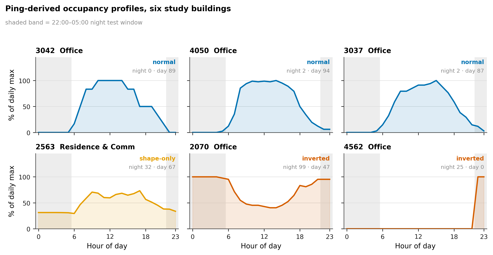

**Figure 4. Ping-derived occupancy profiles, six study buildings.** Hourly occupancy as a percentage of each building's own daily maximum, showing the three regimes the occupancy layer contains. Buildings 3042, 4050, and 3037 have a normal daytime peak. Building 2563 is one of the 31 buildings whose magnitude was lost to imputation, so only the profile shape survives. Buildings 2070 and 4562 are night-over-day inverted. The shaded band is the 22:00 to 05:00 window of the inversion test, whose companion window is 09:00 to 17:00; the two window means are printed in each panel. Source schedules are derived by the studio from BlogWatcher GPS traces over 15 August 2018 weekdays; this repository holds a single-day extract (Section 5.5).

Two of the 22 study buildings are inverted on the test that the mean of hours 22:00 to 05:00 exceeds the mean of hours 09:00 to 17:00. In the wider set of 136 buildings with data, approximately 24 are inverted on the same test. That count is sensitive to the definition, ranging from 15 to 27 depending on which window pair and which margin are chosen. The 167-building aggregate has a normal daytime peak at hour 15, consistent with the daytime-peaking profiles the studio reports for its exemplary buildings.

The underlying data is sound: the single-day extract holds 25,254 pings from 812 devices, with 76.3% of pings between 08:00 and 17:00 and a peak hour of 12. The most likely cause of the inverted subset is overnight dwell bias in the per-building counts, where a device parked near a building all night produces more pings than transient daytime visitors. The correct treatment is to use ping schedules as shape priors for buildings that pass a daytime-dominance test, to fall back to archetype schedules elsewhere, and to report how many buildings fall in each bucket.

### 5.8 Geometry defects and the floor-area repair

| Building | Height (m) | nfloor as published | m per floor as published | GFA as published (m²) |
|---|---|---|---|---|
| 2563 | 30.0 | 2 | 15.0 | 82 |
| 3067 | 24.6 | 2 | 12.3 | 51 |
| 2070 | 29.7 | 5 | 5.94 | 411 |

**Table 9:** Buildings flagged by the floor-height check in the published source geometry.

Table 9 lists the three buildings the floor-height check flags. Because GFA is computed as footprint area times nfloor, buildings 2563 and 3067 received implausibly small floor areas, and under the pro-rata scheme that error passed straight into their energy values. This is a defect in the source geometry, not in the extraction code. The scene builder now rebuilds nfloor from height at 3.5 m per floor for those two buildings and records the correction in a `geometry_flag` field: 2563 becomes 9 floors at 3.33 m and 3067 becomes 7 floors at 3.51 m. Building 2070 at 5.94 m per floor is borderline and is flagged rather than corrected.

### 5.9 Coordinate frames

The mobility pings are stored in EPSG:6677 (JGD2011 / Japan Plane Rectangular CS IX). The energy scene uses a local equirectangular frame anchored at the block centroid, with meters per degree approximated by constants. A `pyproj` transform is needed to place pings correctly in the scene and in any USD export.

### 5.10 Heating dominance

Heating-dominated end use appears in 19 of the 22 source workbooks, under the criterion that annual heating exceeds annual cooling plus lighting combined. Under the weaker criterion that heating exceeds cooling alone, all 22 workbooks are heating dominated, so the count depends on which test is used and the stricter one is reported here. The REopt monthly load is winter-peaked: January 150.8 MWh against July 86.0 MWh, with an annual minimum of 75.8 MWh in June.

This is not a parsing artifact, and it is not this study's inference. The studio reports the same pattern as a model output. Heating accounts for 411,313 kWh, or 64.5% of its 637,658 kWh district baseline, against 96,877 kWh for cooling and 129,468 kWh for lighting. Its S2 result is driven by the heating reduction that follows from higher R-values (Tokyo Studio Group 1, 2026). A heating-dominated district in central Tokyo remains implausible against general expectations for office stock, where cooling normally dominates. Because the studio also reports calibration against measured energy data provided by Japanese stakeholders, the question is not whether the pattern is real in the model but what the calibration constrained. The consequence for this study is direct: the existing sizing of 417 kW PV and 100 kW / 783 kWh storage was optimized against a winter-peaking load, close to the worst case for solar self-consumption.

### 5.11 The magnitude question and the open reconciliation items

`data/energy/energy_dataset.json` has no generator script in the repository. It appeared fully formed in a single commit, so the pro-rata construction could not be fixed by re-running anything that existed in `scripts/`; a new generator had to be written.

One discrepancy remains unresolved and is treated as a blocker. The `Index_energy` baseline EUIs range from 185.1 to 994.9 kWh/m²/yr. Multiplied by this study's gross floor areas they give Σ(EUI × GFA) = 7,923,977 kWh/yr, which is 12.1× the 655,461 kWh/yr summed from the 22 hourly workbooks and 12.4× the studio's 637,658 kWh/yr district baseline. Per building the ratio is not uniform, ranging from 2.8× for building 3552 to 47.1× for building 4050, which argues against a single unit conversion as the explanation.

Reading the two documents together converts this from an open units question into a specific one about the denominator. The studio's N-UBEM is an LOD1 model with floor-based thermal zoning, and its floor areas are Honeybee model areas rather than footprint area times floor count. If the reported district total is the product of those EUIs and those areas, the implied total floor area behind 637,658 kWh/yr is approximately 2,071 m². This study's block totals are 4,128 m² of footprint and 25,731 m² of gross floor area at a mean 6.2 floors per building. Multiplying the same EUIs by footprint area alone gives 1,205,946 kWh/yr, still 1.9× the studio baseline, so floor count alone does not close the gap.

The open reconciliation items are therefore:

- **Floor-area denominator.** Which area the N-UBEM EUI is normalized by, and how it relates to footprint area times floor count. This is the specific form of the 12.1× question.
- **District baseline.** The 17,803 kWh/yr gap, 2.79%, between the 655,461 kWh/yr summed from the hourly workbooks and the studio's 637,658 kWh/yr baseline, most likely a version or building-set difference.
- **Scenario weighting.** The one-percentage-point difference in the s1 block reduction between the studio's energy-weighted result and this study's GFA-weighted recomputation (Section 5.4).
- **Scenario 2 definition.** Whether S2 is cumulative with the S1 window reduction, as the sheets encode it, or insulation-only, as the report's prose describes it (Section 5.3).

Until these are resolved with the studio team, figures use the EUI values for relative comparison and ranking only, with the absolute scale labeled unverified, and no absolute-value figure or REopt re-run ships.

### 5.12 Verification checks

V1 to V8 are implemented as assertions in the scene builder, which writes nothing when a check fails. V9 to V12 run in the USD QA script, added with the exporter in Stage C. V13 is added with the Stage A occupancy extraction (Table 10). A failing assertion blocks the figure.

| # | Check | Pass condition | State |
|---|---|---|---|
| V1 | Distinct intensities | At least 15 distinct rounded intensities across 22 buildings. Catches any recurrence of the pro-rata construction | Passing at 22 of 22 |
| V2 | Plausible intensity range | All per-building intensities within 50 to 1,200 kWh/m²/yr. Any value outside it is listed, not silently clipped | Passing at 185.1 to 994.9 |
| V3 | ID set equality | Building ID sets from the geometry, the legacy dataset, the three Index sheets, and the 22 workbooks are identical | Passing. The same 22 IDs in every source |
| V4 | Floor height sanity | 2.5 m ≤ height/nfloor ≤ 6.0 m for every building, after the Section 5.8 repair | Passing. 2563 and 3067 repaired, 2070 flagged |
| V5 | Sheet-total reconciliation | Stored Σ(EUI × GFA) agrees with a recomputation from the Index sheets to within 0.5%, for all three scenarios | Passing |
| V5b | Workbook reconciliation | Reported, not asserted: Σ(EUI × GFA) against the sum of the 22 hourly workbooks, with the ratio printed | Reported at 12.1×, the Section 5.11 blocker |
| V6 | Load decomposition | Building kWh plus vehicle kWh equals the REopt site load to within 1 kWh | Passing. Residual 0.00 kWh |
| V7 | Scenario consistency | `annual_reduction_kwh` equals `annual_reduction_pct` × baseline total, to within 0.5%, for s1 and s2 | Passing |
| V8 | Scenario coverage | Every building carries a usable EUI for baseline, s1, and s2 | Passing for all 22 |
| V9 | USD structure | `usdchecker` passes with no errors on the exported stage | With the exporter, Stage C |
| V10 | USD units | `metersPerUnit == 1.0` and the up axis is set on the stage | With the exporter, Stage C |
| V11 | USD content | Exactly 22 building meshes, each with a non-degenerate triangulated cap and outward normals | With the exporter, Stage C |
| V12 | CRS round-trip | A ping transformed EPSG:6677 to WGS84 to scene-local meters and back lands within 0.5 m of its origin | With the exporter, Stage C |
| V13 | Occupancy coverage | Every building's occupancy record is tagged `magnitude_ok`, `shape_only`, or `archetype_fallback` | With Stage A occupancy extraction |

**Table 10:** Verification checks and their current state.

---

## 6. Methodology

The methodology is a staged research design. Each stage produces outputs that become inputs to the next: Stage A establishes a demand layer that can carry an absolute claim, Stage B runs the fidelity experiment on it, and Stage C builds the bridge to the simulation tier.

### 6.1 Units and normalization conventions

These are locked so that every figure and table uses the same basis (Table 11). Any deviation is labeled in the figure.

| Quantity | Convention |
|---|---|
| Energy | **Site** electricity, kWh. Source energy is not used. If a source conversion is ever needed, it is stated with its factor |
| Energy intensity | kWh/m²/yr, **site**, denominator = gross floor area. Abbreviated EUI throughout |
| Gross floor area | Footprint polygon area × `nfloor`, with the floor-height repair of Section 5.8 applied and recorded per building |
| Temporal basis | **Annual** totals for sizing and ranking. **Peak-day** (24 h) profiles for schedule and dispatch figures. Never mixed on one axis |
| Building vs vehicle load | Always reported separately. The combined figure is labeled "building + vehicle charging" and never called "building energy" |
| Scenario deltas | Percent change from baseline, **GFA-weighted** at block level, unweighted per building. Both are shown, and the studio's energy-weighted basis is stated alongside where it differs |
| Currency | JPY, millions (¥M), as in the source workbooks. Where USD is shown, the rate and its date are stated inline |
| Carbon | tonnes CO2 per year, from the REopt utility output, attributed per building in proportion to corrected load |
| Coordinates | WGS84 (EPSG:4326) for all display. EPSG:6677 for ping source data, transformed via `pyproj`. Scene-local meters for USD, with the anchor recorded in metadata |
| Occupancy | Fraction of daily maximum, 0 to 1, 24 values. Buildings with imputed-empty magnitude are marked shape-only |

**Table 11:** Units and normalization conventions locked for every figure and table.

The magnitude rule adopted after the audit follows from Section 5.11. EUI values drive relative per-building intensity and relative scenario deltas, while absolute annual kWh per building is reconstructed by rescaling the EUI-weighted distribution so that the block total matches the 655,461 kWh/yr workbook sum. This preserves both the per-building variation and a defensible block total, and it is reversible once the studio team answers the denominator question.

### 6.2 Stage A: calibration and the supply re-run

Stage A rebuilds the per-building energy record from the N-UBEM EUIs with the reconciliation items of Section 5.11 resolved, and with EV and bus load separated from building load as a distinct scene layer. Occupancy schedules are then built from the ping data for the subset of buildings that pass a daytime-dominance test, with archetype fallback elsewhere and the split reported; the parent 15-weekday dataset is the reference for stability, not the single-day extract.

The supply optimization is then re-run or re-scaled under three load constructions: pro-rata flat, EUI-corrected, and EUI-corrected plus ping occupancy. The change in cost-optimal PV and storage is reported against the thresholds in Section 3.1. This is the primary result. Its figure is a dual-panel grouped column, PV kW and storage kWh across the three constructions, which must fill the sentence: "Correcting per-building intensity and occupancy changes cost-optimal PV from 417 kW to ___ kW and storage from 783 kWh to ___ kWh, which does or does not cross the 10% materiality threshold."

### 6.3 Stage B: the fidelity evaluation and one closed loop

Stage B runs the experiment the ladder was built for. Each of the three decisions is answered at L1, then at L2, and the tier at which the recommended action stops changing is recorded in the decision-by-tier matrix. In parallel, the retrofit-to-heat-to-routing loop named in Section 1 is closed for one scenario pair at L2, producing a paired-map heat-difference figure with a difference inset. That figure is outlook material and the substance of a follow-on conference paper.

### 6.4 Stage C: the simulation-tier bridge

Stage C writes the simulation-ready USD export for the 22-building scene and carries it across the L2 to L3 bridge. The export is a format-feasibility artifact, not a SimReady asset: SimReady requires physically based materials, semantic labeling, and physics properties that this export does not provide. It demonstrates that the scene's geometry and per-building attributes survive the round trip into the interchange format both platform paths consume. Checks V9 to V12 run against the exported stage, and `usdchecker` output is reported verbatim.

Six traps are handled, all verified relevant in this environment with `usd-core` 26.8. `metersPerUnit` must be set to 1.0, because the default of 0.01 would silently shrink the block by 100×. The stage up axis must be set rather than defaulted. The scene frame is +X east, +Z north, +Y up, which is left-handed against three.js, so converting requires flipping an axis. Flipping an axis reverses ring winding and inverts normals, so winding must be reversed with it. Concave footprints need triangulated caps rather than naive fans. And ping positions must be transformed from EPSG:6677 with `pyproj` rather than the local equirectangular approximation.

The L3 tier is then built on whichever platform access materializes, one decision is ported, and the decision-by-tier matrix is completed. The agentic and LLM scenario layer, if built, sits here as an interface convenience and is not the headline (Section 4.3).

---

## 7. The Web-Based Digital Twin

The L2 tier is the part of this study that exists as a running artifact rather than a plan; Table 12 records what runs today. This section reports it as a design study: what changed, what the interface commits to, and how the captures in this document are reproduced.

### 7.1 From designed base to photoreal context

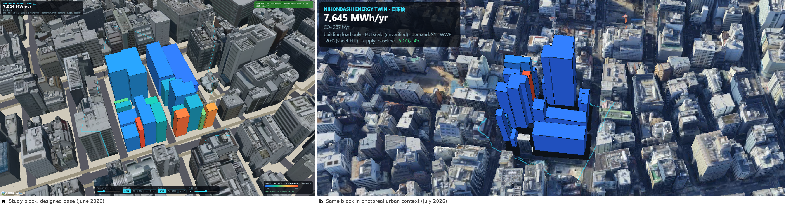

**Figure 5. The same study block, one month apart.** (a) The 22 study buildings on the designed streetscape base, June 2026. (b) The same block, the same metric and the same demand state, on photoreal urban context, July 2026. Both panels color the block by energy use intensity under baseline demand at the same scale, so the change between them is context, not data. Basemap in (b): Google Photorealistic 3D Tiles, © Google.

The move from panel (a) to panel (b) costs nothing at simulation time and changes what the twin can be used for. The block is now legible against the real street pattern, building heights, and neighbors that a stakeholder recognizes, which is the condition under which a twin can carry a conversation rather than illustrate one.

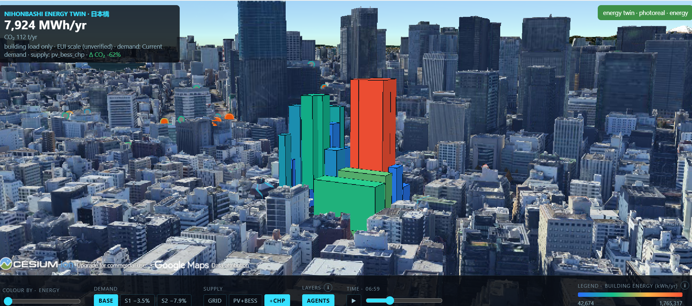

**Figure 6. The study block on photoreal urban context.** The 22 study buildings colored by annual building energy at a day simulation time. The headline reports building load only: EV and bus charging are excluded, and the absolute scale comes from the unverified N-UBEM EUI column (Section 5.11). The demand buttons carry the recomputed block reductions, S1 -3.5% and S2 -7.9%, in place of the flat -5% and -15% the twin previously applied. Basemap: Google Photorealistic 3D Tiles, © Google; rendered with CesiumJS.

### 7.2 Switching metric: intensity and the retrofit parameter behind it

The audit's consequence for the interface is that a metric switch now changes what the block looks like. Under the pro-rata construction, the intensity layer was a single value repeated 22 times, so switching to it produced a uniformly colored block.

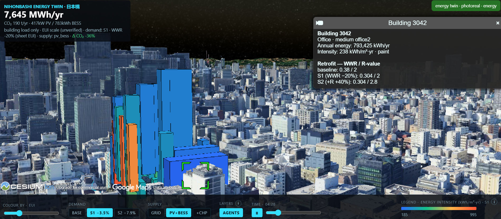

**Figure 7. The energy use intensity layer.** The block colored by EUI under scenario S1, with building 3042 selected. The legend ramp spans 185.1 to 994.9 kWh/m²/yr across the 22 study buildings; the grey massing is PLATEAU and photoreal context and carries no data. The absolute scale is unverified (Section 5.11), so the ramp supports comparison and ranking rather than a level claim. Basemap: Google Photorealistic 3D Tiles, © Google.

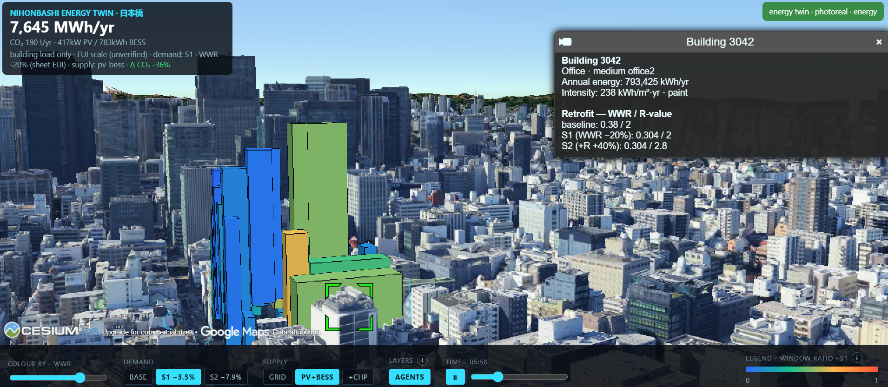

**Figure 8. The window-to-wall ratio layer.** The same block and the same selected building colored by window-to-wall ratio, the retrofit parameter that drives the S1 deltas in Figure 7. Holding the selection while switching the metric is how the twin connects an envelope parameter to its energy consequence at the building scale. The studio derives these ratios from street-view imagery segmented with the Segment Anything Model (Tokyo Studio Group 1, 2026). Basemap: Google Photorealistic 3D Tiles, © Google.

### 7.3 The per-building record in the view

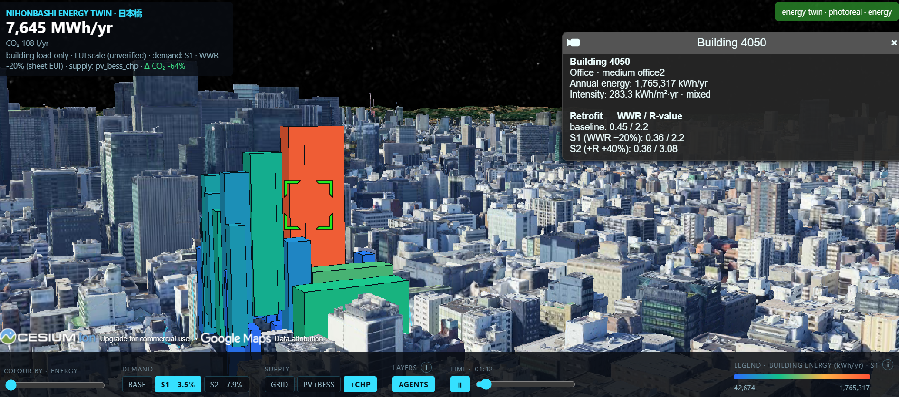

**Figure 9. Per-building record, building 4050 under S1.** Selecting a building exposes the record the twin is built on: use, program, annual energy, intensity, and the window-to-wall ratio and R-value triple for baseline, S1, and S2. Under the previous pro-rata construction, the intensity field carried 49.93 kWh/m²/yr for every one of the 22 buildings. Building 4050 is also the largest absolute saver under S2 (Figure 12) and the building with the widest EUI-to-workbook ratio, 47.1× (Section 5.11). Basemap: Google Photorealistic 3D Tiles, © Google.

A twin that carries one intensity for every building has nothing to show when a building is selected. A twin that carries the N-UBEM record per building can show the parameters that produced the number, which is what makes a retrofit conversation possible at the building scale.

### 7.4 Occupancy and the agent layer

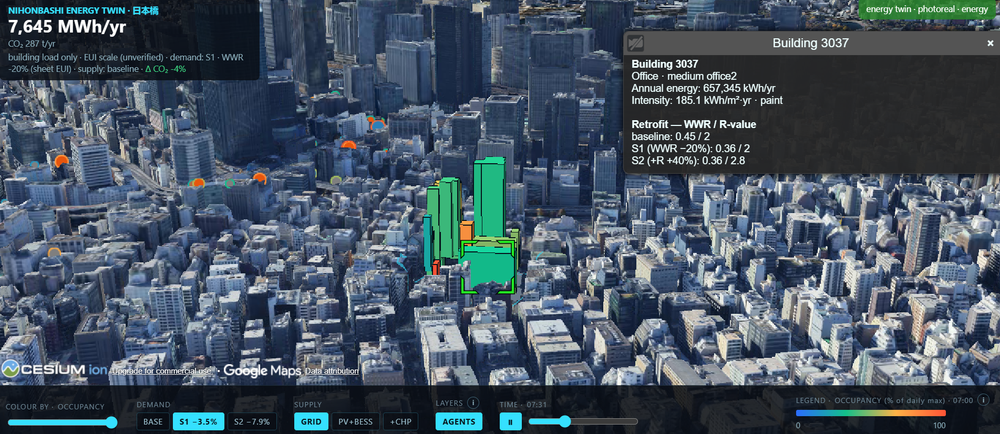

**Figure 10. Ping-derived occupancy with the agent layer on.** The block colored by occupancy as a fraction of each building's own daily maximum, with the Mesa pedestrian agents drawn on the street network. This is the precursor to decision D-3: the agents route on the heat-cost field, which is not yet driven by the building loads shown here (Section 1). The building selected here, 3037, is one of the normal daytime-peaking profiles in Figure 4. Basemap: Google Photorealistic 3D Tiles, © Google.

### 7.5 Interface and georeferencing

The twin presents one surface system. A single bottom dock carries the metric, demand, supply, layer, and clock controls, with the color legend integrated as its right-most group, so no panel overlaps another. Every group label uses one microlabel style, and the metric slider and the clock are the same slider component. The clock is labeled SIM TIME, because it drives agent positions, the occupancy metric, and the sun, and does not relight the photoreal base mesh. Provenance and caveats live behind information affordances next to the values they qualify rather than as floating text, and the Cesium and Google attribution container is lifted clear of the dock and left fully visible.

The 22-building energy scene is correctly georeferenced: real WGS84 footprints, stored as local meters and re-projected by the view with the same anchor and constants, so the round trip is exact to the stored 0.01 m rounding. The high-fidelity PLATEAU city twin is georeferenced on both default paths, by different mechanisms. One path streams the official PLATEAU LOD2 Cesium 3D Tileset published by MLIT, so it carries the publisher's own geodetic frame. The other decodes each source tile through CESIUM_RTC to ECEF, then to geodetic, then into the same local-meter frame and anchor as the OSM street network. Every vertex is therefore placed by its true earth-centered position, and the buildings share the street frame by construction rather than by fitting. An unregistered legacy placement survives only behind a query parameter, which no figure in this document uses.

Accuracy is not claimed. The ECEF construction guarantees the correct frame, not a measured residual, and the visual confirmation against the OSM road centerlines has not yet been captured. No sub-meter alignment claim is made in this document.

### 7.6 Reproducible capture

Eight captures are committed in `outputs/figures/photoreal/`, labeled C0 to C7, together with the two-panel evolution composite used as Figure 5. C1 through C6 were captured interactively on GPU hardware on July 28, 2026, at 1920 × 1200. C0 and C7 sit on the designed streetscape base, C0 from the headless pose harness in this codespace. The camera poses are committed as `outputs/qa/camera_poses.json`, which `scripts/qa_cesium_views.mjs --poses` reads, so any re-capture reproduces the identical frame; the pose file records the harness path, the render settings, and the local server the views must be served from. Fields per pose are `lon`, `lat`, `height_m` (ellipsoidal), `heading_deg`, `pitch_deg`, and `roll_deg`, plus the UI state. Captures C0 and C7 carry the designed base and the plan-view reference frame respectively; the remaining six appear as Figures 2 and 5 to 10.

A 36-second demonstration video accompanies this document as `outputs/reports/demo_video.mp4`. It is produced by the same reproducibility discipline as the still captures: `scripts/record_demo_video.mjs` renders the video offline, one frame at a time, by setting the camera pose and the simulation clock explicitly, driving the interface through its own controls, and waiting for tile streaming to converge before each capture, so two runs of the script produce the same video. The storyboard covers the approach to the block, an orbit, the four metric layers, the demand and supply scenarios with the emissions delta, the agent layer under a 07:00 to 19:00 clock sweep, and a closing wide view. The committed render was produced under software rasterization in this codespace; the same script re-renders the identical storyboard at full visual quality on GPU hardware. The Google and Cesium attribution is part of the page and appears in every frame.

Every capture on the photoreal base carries the on-screen Google and Cesium ion attribution, and that attribution must remain intact and legible in any reproduction. One known constraint: this codespace has no GPU, and software rendering is too slow to screenshot either the legacy welded city mesh or the streamed Google tiles reliably. Photoreal captures are therefore taken on hardware-accelerated machines, with the poses applied from the pose file.

### 7.7 Implementation status

| Asset | Status |
|---|---|
| Energy twin, Cesium (L2) | Working. The 22 buildings in real WGS84 position, defaulting to Google Photorealistic 3D Tiles, with a designed streetscape and georeferenced PLATEAU LOD2 context as alternate bases |
| Energy twin, offline | Working. three.js; no map-tile, terrain, or token dependency; used for headless QA |
| Analytical dashboard (L1) | Working. Streamlit, four tabs: twin, metrics, architecture, handoff |
| High-fidelity city twin | Working. Official PLATEAU LOD2 tileset, and the georeferenced LOD2 build |
| Scene builder | Working. Reads WWR, R-value, and the per-sheet EUI. Runs V1 to V8 and fails the build on violation |
| Per-building records, legacy | **Compromised.** Pro-rata split (Section 5.1). No generator script exists. No longer the twin's energy source |
| Per-building records, current | Working. Rebuilt from the N-UBEM EUIs, 22 distinct intensities, vehicle load held block-level |
| Heat-cost field | Working. Precomputed, not coupled to building loads |
| Robot ABM testbed | Working, first stage. Heat-aware routing, A/B scenarios. Not coupled to the energy layer |
| Simulation-ready USD export | Not yet written. Stage C. `usd-core` 26.8 verified working in this environment |
| L3 GPU environment | Not secured. No allocation requested |

**Table 12:** Implementation status of the twin and its supporting artifacts.

---

## 8. Preliminary Results

Three results are available from the corrected demand layer alone, without the supply re-run. They answer RQ1 and characterize the input to RQ2. All three carry the unverified-scale caveat of Section 5.11: the ranking and the relative deltas are the defensible reading, not the level.

### 8.1 Per-building intensity replaces a single constant

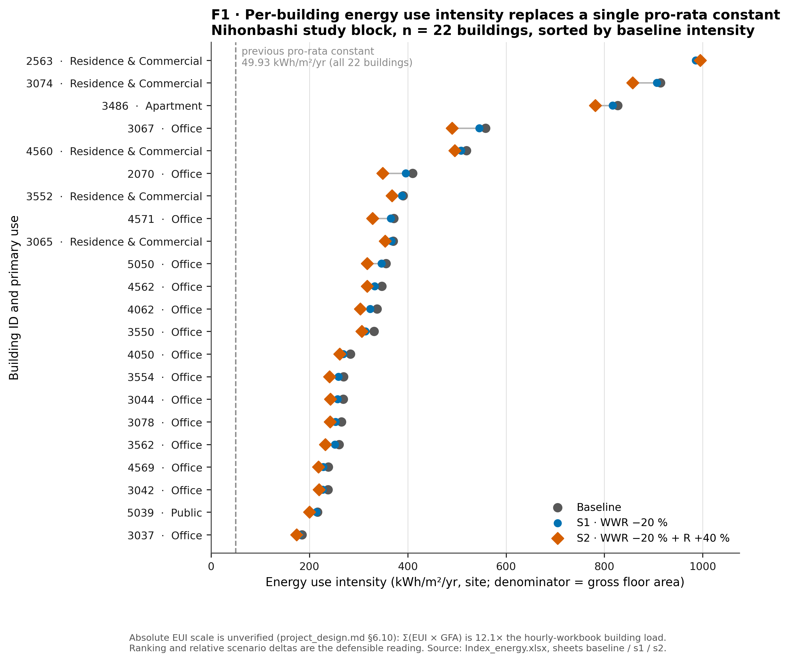

**Figure 11. Building energy use intensity by scenario.** Site energy use intensity of the 22 buildings in the Nihonbashi study block, sorted by baseline intensity. Grey = baseline, blue = S1 (window-to-wall ratio −20%), vermillion = S2 (WWR −20% and R-value +40%); the connector spans the baseline-to-S2 travel. The dashed line at 49.93 kWh/m²/yr is the single pro-rata constant the twin previously assigned to every building. Denominator is gross floor area. The absolute EUI scale is unverified (Section 5.11): Σ(EUI × GFA) = 7,923,977 kWh/yr is 12.1× the hourly-workbook building load of 655,461 kWh/yr. n = 22.

Replacing the pro-rata split with per-building intensity widens the block's intensity range from the single value 49.93 to a range of 185.1 to 994.9 kWh/m²/yr. Ranking the block by corrected annual energy moves 14 of the 22 buildings out of the position the pro-rata construction gave them. The Spearman rank correlation against that ordering, which is the gross floor area ordering, is 0.897. Both halves of the building-scale ranking criterion in Section 3.1 are therefore crossed, though the correlation only marginally: 14 buildings move against a threshold of 5, while the correlation sits 0.003 below the 0.9 threshold. The answer to RQ1 is that retrofit priority is sensitive to the demand representation, and the sensitivity is clearer in rank displacement than in rank correlation.

### 8.2 Retrofit priority changes with it

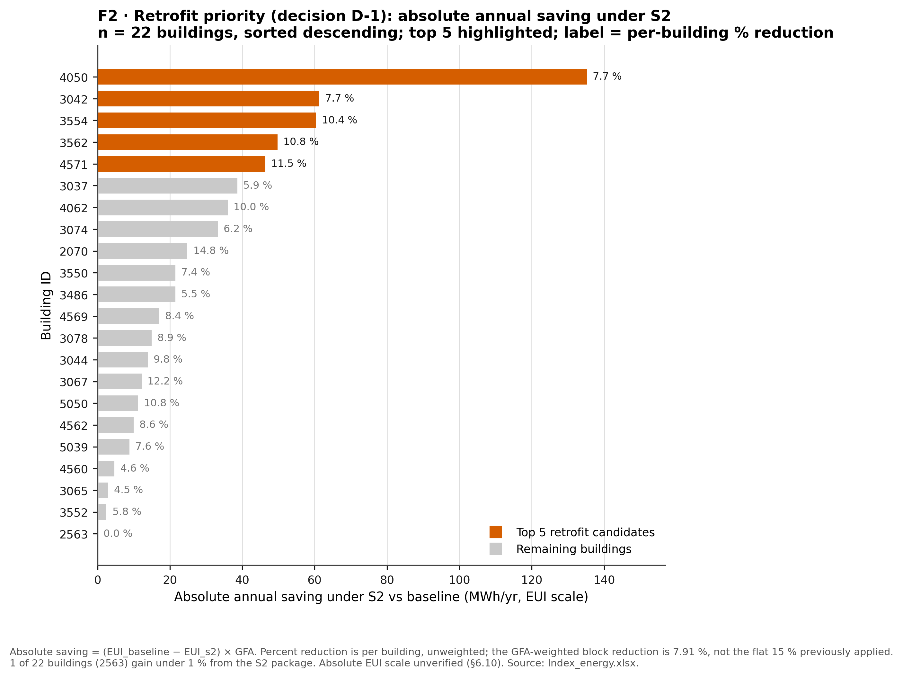

**Figure 12. Annual saving under S2 by building.** Absolute annual electricity saving under retrofit scenario S2 against baseline, per building, sorted descending; the five largest are highlighted and support decision D-1. Saving = (EUI_baseline − EUI_S2) × GFA. The label on each bar is that building's own percentage reduction, unweighted; the GFA-weighted block reduction is 7.91%, against the studio's energy-weighted 7.77% and the flat 15% the view previously applied. 1 of 22 buildings (2563) gains under 1% from the S2 package. Absolute EUI scale unverified (Section 5.11). n = 22.

The five buildings returning the largest absolute annual saving under S2 are 4050 at 135.2 MWh/yr, 3042 at 61.3, 3554 at 60.4, 3562 at 49.8, and 4571 at 46.3. Under the pro-rata construction, savings were proportional to floor area by definition, so the ranking was a floor-area ranking and the top-5 set changes by more than two members once intensity varies. The spread that produces this is not uniform: per-building reductions run from 0.00% for building 2563 to 14.76% for building 2070, so a flat district-wide envelope package would over-promise on some buildings and under-promise on others. This is the same conclusion the studio reaches from its own model, that retrofit strategies should be building-specific rather than applied identically across the district.

### 8.3 Half the load the supply was sized against is not building load

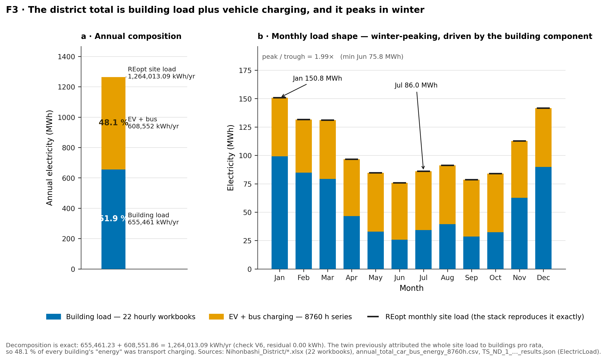

**Figure 13. District electricity: composition and seasonality.** (a) Annual site electricity for the block, split into building load (655,461 kWh/yr, from 22 hourly workbooks) and EV plus bus charging (608,552 kWh/yr, from the 8760-hour series). (b) The same two layers by month; the black ticks are the monthly site load the REopt supply optimization was sized against. The decomposition is exact: 655,461.23 + 608,551.86 = 1,264,013.09 kWh/yr, residual 0.00 kWh (check V6). The twin previously attributed the whole site load to buildings pro rata, so 48.1% of every building's reported energy was transport charging. Building load and vehicle charging are never summed into a per-building figure.

48.1% of the load the supply optimization was sized against is vehicle charging, and the combined load peaks in January at 150.8 MWh against 86.0 MWh in July, a peak-to-trough ratio of 1.99. The existing 417 kW PV and 783 kWh storage were therefore sized against a winter-peaking, transport-heavy load. Whether correcting the composition moves the cost-optimal sizing past the 10% thresholds in Section 3.1 is the Stage A question, and Figure 13 is the input to it rather than the answer.

### 8.4 Status against the materiality thresholds

| Criterion | Status |
|---|---|
| Building-scale ranking | **Crossed.** 14 of 22 buildings change rank; Spearman ρ = 0.897 against the GFA ordering, below 0.9 |
| Retrofit priority | **Crossed.** The top-5 set changes by more than 2 members |
| Block-scale PV sizing | Open. Requires the Stage A supply re-run |
| Block-scale storage sizing | Open. Requires the Stage A supply re-run |

**Table 13:** Status against the materiality thresholds of Table 2.

Two of the four criteria in Table 13 are crossed at building scale before the supply optimization is re-run. That asymmetry is itself a result worth carrying into Stage A: the representation clearly matters for which building to touch first, and it remains an open question whether it matters for what the block should buy.

---

## 9. Risks and Limitations

The largest risk to the research design is access to a GPU environment for the L3 tier. No allocation exists or has been requested for Omniverse or Isaac Sim, and the schedule treats that access as uncertain. The ladder is a framework, not a dependency, and the PLATEAU Unity path runs on consumer hardware. If neither materializes, the simulation tier is reported as unexecuted with an argument for what it would have added, and the study still delivers its L1 and L2 results. The second risk is that the reconciliation items in Section 5.11 stay open, which would block every absolute-value claim and leave the study reporting relative comparisons only. The third is availability of the teammate datasets, addressed in the acknowledgment below.

1. **Archetype-based and simulated, not metered by this study.** The per-building intensities are N-UBEM outputs. The studio reports calibrating them against measured data provided by Japanese stakeholders, but this study does not independently reproduce that calibration and has no metered kWh for the 22 buildings. The study calibrates between representations; it does not validate against reality.
2. **n = 22.** One block, 22 buildings. Findings are a case study. No claim generalizes statistically to Tokyo or to other districts.
3. **Mobility data from 2018.** The parent GPS dataset covers 15 weekdays in August 2018, and the extract in this repository covers a single day of it. It carries no seasonal, weekday-versus-weekend, or post-pandemic variation, and it predates the study period by eight years. Occupancy derived from it is a shape prior, not a measurement.
4. **No usable occupancy magnitude for 31 buildings**, including three study buildings (2563, 3067, 4560).
5. **Geometry defects in the source data** affect at least two study buildings (Section 5.8). The floor counts are repaired from height and flagged, but the underlying footprint geometry is not correctable without better source data.
6. **The city twin is georeferenced but its alignment residual is unmeasured.** Both default paths are georeferenced by construction (Section 7.5). The residual against the OSM road centerlines has not been quantified, so street-level spatial claims are stated as approximate.
7. **The heating-dominated load profile is implausible for Tokyo offices** and is inherited from the N-UBEM. Until it is explained, all supply-sizing results carry that inherited assumption.
8. **The absolute EUI scale is unverified.** The reconciliation items of Section 5.11 are open, so every absolute intensity in this document is a relative quantity with a provisional scale.
9. **The system is co-located, not yet coupled.** No information flows from the energy layer to the heat layer to the mobility layer. Closing one loop remains research work rather than completed work.
10. **The L3 simulation tier does not exist yet.** All statements about what it would add are hypotheses to be tested rather than results.

---

## 10. Conclusion and Outlook

The diagnostic reported here changes what this project is about. A twin of 22 buildings that presented a confident per-building energy surface was in fact presenting one district total divided by floor area. Of that total, 48.1% belonged to vehicle charging rather than to buildings. The correction was available the whole time, in a column of the studio's own N-UBEM output that no code path read. Reconstructing the demand layer from that column moves 14 of the 22 buildings out of their previous rank, changes the top-5 retrofit set, and leaves the block-level supply question open pending the re-run. Two of four pre-registered materiality thresholds are crossed before any fidelity comparison begins, which is the condition the fidelity experiment needed: a data layer whose numbers mean what their labels say.

The second contribution is to hold the fidelity ladder to the same standard. Streaming photoreal tiles into the web tier raised its appearance to something close to a game-engine capture at no simulation cost. In doing so it narrowed rather than widened the case for a simulation tier. What remains for that tier to justify is semantic structure, controllable lighting and weather, and collision and sensor physics, none of which a photogrammetric mesh with a baked sun can supply. Whether any of the three decisions in this study requires them is a question the decision-by-tier matrix will answer rather than assume. Stage A results and the fidelity evaluation framework are the intended basis of a CUPUM 2027 book chapter, with the closed retrofit-to-heat-to-routing loop as its outlook.

---

## Acknowledgments and Data Availability

The retrofit parameter sheets, the 22 per-building hourly workbooks, the REopt supply optimization, and the GPS-derived occupancy schedules used here were produced by the Tokyo Smart City Studio team. They are documented in that team's companion report (Tokyo Studio Group 1, 2026), and the mobility traces behind the schedules originate with BlogWatcher. Their use here is gratefully acknowledged, and a written agreement on attribution, citation, and publication rights for those datasets is being formalized with the studio team ahead of any journal submission. The PLATEAU LOD2 city model is open data from Japan's Ministry of Land, Infrastructure, Transport and Tourism, and the road network is OpenStreetMap under ODbL. The photorealistic basemap is Google Photorealistic 3D Tiles served through Cesium ion, whose on-screen attribution is retained in every capture. The integration pipeline, the reconciliation and calibration method, the twin, the verification suite, and the fidelity evaluation framework are the author's own. They would survive intact on public archetype data if any teammate dataset had to be replaced.

---

## References

Anderson, K., et al. (2017). *REopt: A platform for energy system integration and optimization* (NREL/TP-7A40-70022). National Renewable Energy Laboratory. https://doi.org/10.2172/1395453

Hossain, M. I., Hossan, M. R., Shaon, Z. H., & Ferdous, M. N. (2026). Linking digital twin paradigm for urban heat monitoring and policy integration to building smart city climate resilience. *Discover Cities*, 3, 1. https://doi.org/10.1007/s44327-025-00179-8

Lin, Z., & Wang, K. (2026). *SenseWalk: Agent-based semantic trajectory simulation powered by large language models in zoned environments*. arXiv:2607.00989. https://arxiv.org/abs/2607.00989

Ministry of Land, Infrastructure, Transport and Tourism (Japan). *PLATEAU: 3D city model open data*. https://www.mlit.go.jp/plateau/ (accessed July 28, 2026)

NVIDIA. (2025). *NVIDIA Omniverse Blueprint for smart city AI*. https://blogs.nvidia.com/blog/smart-city-ai-blueprint-europe/ (accessed July 28, 2026)

Paule, D., Pubule, J., Gabranova, U., Blumberga, A., & Blumberga, D. (2026). Digital twins for sustainable urban energy systems: a systematic review of market mechanisms, flexibility, and coordination at the district scale. *Frontiers in Sustainable Cities*, 8, 1837026. https://doi.org/10.3389/frsc.2026.1837026

Tokyo Studio Group 1. (2026). *Developing digital twins for carbon neutrality pathways in Nihonbashi: Activity-informed urban regeneration, enhanced UBEM, smart-grid optimization, and financial feasibility*. Working paper, Georgia Tech Tokyo Smart City Studio.

Xu, H., Zlatanova, S., Li, X., Wachowicz, M., & Batty, M. (2026). Towards fully automated city operations: Integrating agentic AI with urban digital twins. *Computers, Environment and Urban Systems*, 128, 102449. https://doi.org/10.1016/j.compenvurbsys.2026.102449

Ye, X., Gong, W., Yang, Y., Zou, L., Tu, Z., Huang, X., Li, Z., Ning, H., & Wu, L. (2026). Towards Agentic Urban Digital Twins (AUDiTs): advancing new urban science through Human–AI co-learning agents. *Urban Informatics*, 5, 9. https://doi.org/10.1007/s44212-025-00099-3

No claim in this document rests on a source not listed here.
