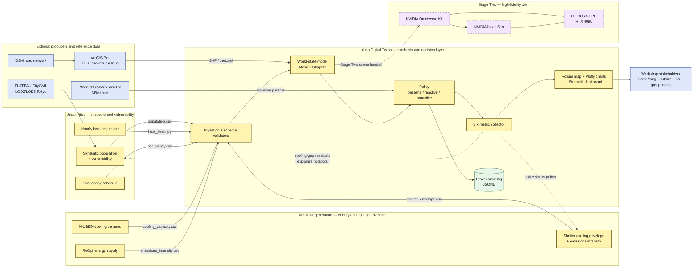
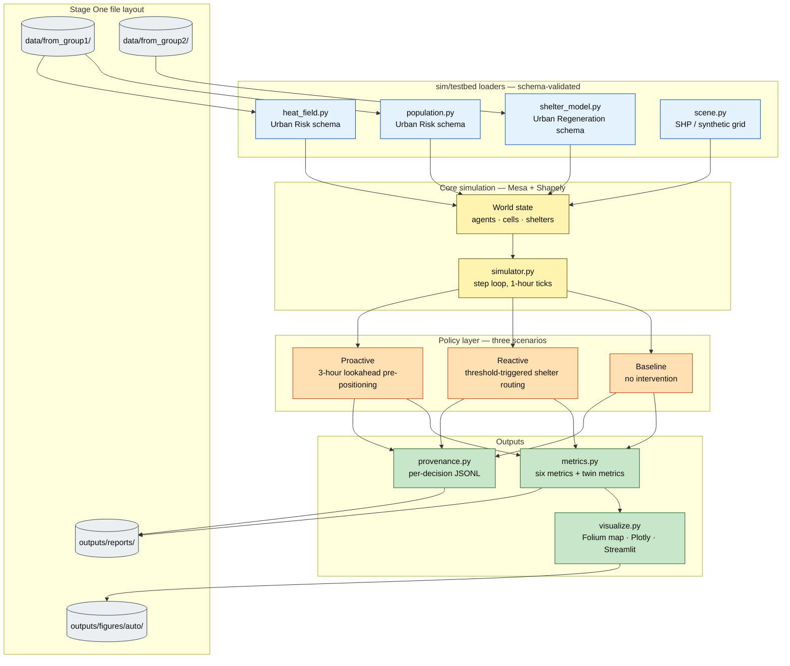
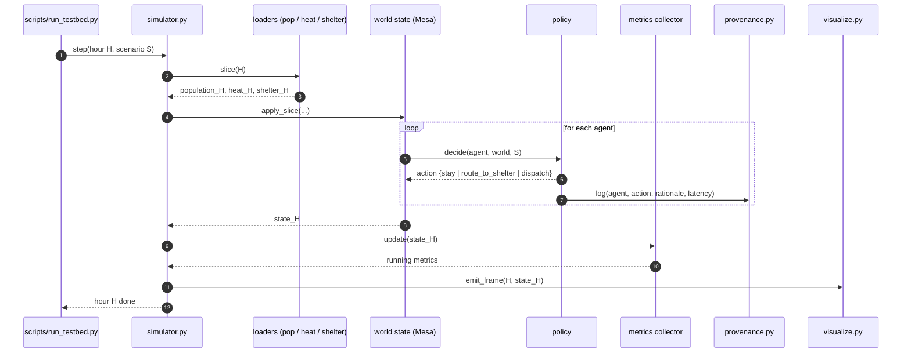
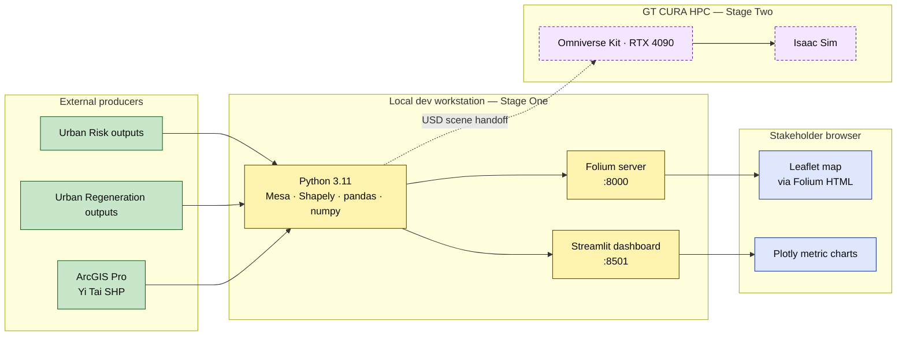
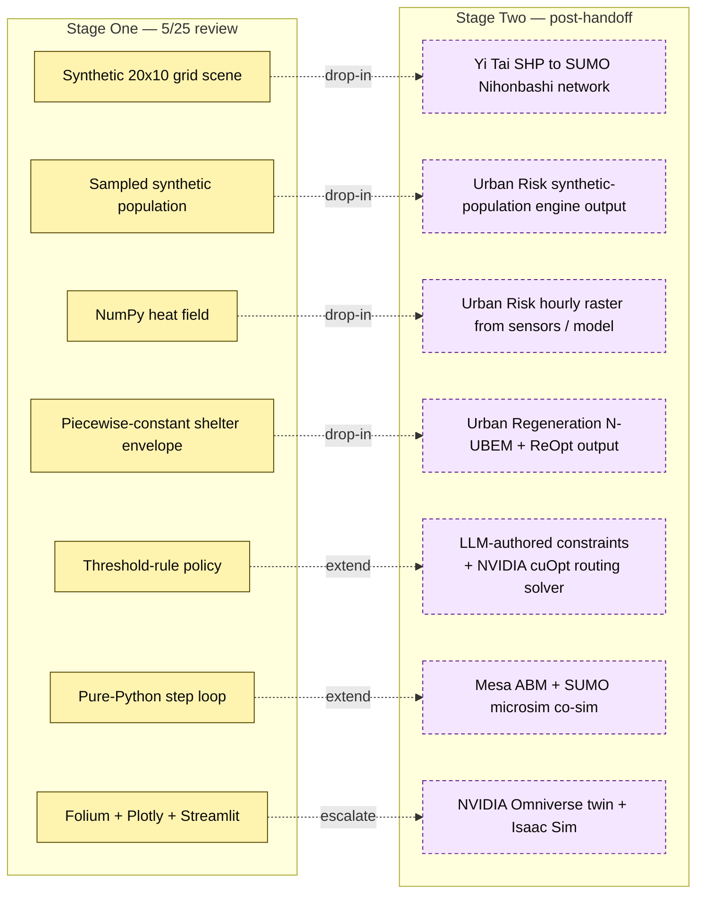

# System Architecture — Urban Digital Twins · Nihonbashi

| | |
|---|---|
| **Print revision** | v0.3 — 2026-05-25 |
| **Status** | Ready for Stage One review (5/25) |
| **Owners** | Sam Duong (M&V / orchestration), Yi Tai (ABM + SHP→SUMO scene), Xilin Tang (methodology), Murugesan Devesh (Urban Regeneration bridge / shelter modeling) |
| **Companion docs** | [methodology.md](methodology.md) · [stage1_research_design.md](stage1_research_design.md) · [visualization_plan.md](visualization_plan.md) · [system_design_print_prompt.md](system_design_print_prompt.md) |
| **Viz stack (Stage One)** | **Re:Earth** (browser, PLATEAU 3D Tokyo) + **Streamlit** (metrics dashboard). See [visualization_plan.md](visualization_plan.md). |
| **Diagram source** | Mermaid (renders in GitHub, Notion, VS Code, Obsidian, draw.io, GitLab). For one-click rendering see <https://mermaid.live>. |

---

## 1. One-paragraph summary

Urban Digital Twins is the **synthesis and decision layer** of the 2026 Summer Tokyo Workshop's Nihonbashi study. We do **not** generate the ground-truth heat-exposure field (Urban Risk) or the building cooling envelopes (Urban Regeneration). Urban Digital Twins ingests both teams' outputs against a documented schema, runs an **agent-based decision loop** that produces reactive shelter allocations and proactive resource dispatches, computes the **six evaluation metrics** from the Xilin methodology, and renders an **interactive Folium map** plus a Plotly comparison report. For Stage One (5/25), the loop runs on synthetic placeholder data that matches the locked Urban Risk/Urban Regeneration schemas; the loaders swap when real data lands, and nothing else changes.

---

## 2. System Context (who talks to whom)

**Legend** — solid arrow = Stage One data flow; dashed arrow = feedback or Stage Two handoff; yellow = team subsystem; blue = external; green = data store; purple-dashed = Stage Two (deferred).

---

## 3. Container view — inside Urban Digital Twins

---

## 4. Decision-loop sequence — one simulated hour

---

## 5. Deployment view — where each thing runs

---

## 6. Stage One vs Stage Two — what swaps

---

## 7. Interface contracts

### 7a. Urban Risk → Urban Digital Twins

| File | Format | Required columns / shape | Cadence |
|---|---|---|---|
| `population.csv` | CSV, UTF-8 | `agent_id`, `age_bucket` (child/adult/elderly), `occupation_class` (worker/commuter/visitor/resident/student), `mobility_class` (mobile/assisted/restricted), `vulnerability_score` [0,1], `home_grid_cell`, `hour` [0,23], `activity_grid_cell` | One row per agent per hour |
| `heat_field.npy` | NumPy `.npy` | shape `(24, 20, 10)` — hours × x × y, value = heat-cost factor in [0, 2] | Hourly raster |
| `occupancy.csv` | CSV | `building_id`, `hour`, `occupants_total`, `vulnerable_weighted_occupants` | Hourly |

### 7b. Urban Regeneration → Urban Digital Twins

| File | Format | Required columns | Cadence |
|---|---|---|---|
| `shelter_envelope.csv` | CSV | `building_id`, `hour`, `max_occupants`, `cooling_kwh`, `emissions_intensity` (kgCO2e/kWh) | Hourly |
| `cooling_capacity.csv` | CSV | `building_id`, `nominal_capacity_kw`, `derating_curve_id` | Static per scenario |

### 7c. Urban Digital Twins → Stakeholders

| Artifact | Purpose |
|---|---|
| `outputs/figures/auto/map_h14.html` | Folium interactive map snapshot at 14:00 |
| `outputs/figures/auto/sim_24h.html` | Folium timestepped overlay for the day |
| `outputs/figures/auto/metric_comparison.html` | Plotly six-metric bar chart, three scenarios |
| `outputs/figures/auto/exposure_timeline.html` | Plotly cumulative exposure over the day |
| `outputs/reports/testbed_comparison.md` | Written comparison report |
| `outputs/reports/provenance.jsonl` | Per-decision audit log |

### 7d. Urban Digital Twins → Urban Risk / Urban Regeneration (feedback)

| Artifact | Consumer |
|---|---|
| `cooling_gap_residuals.csv` | Urban Regeneration — agents and hours with no feasible shelter |
| `exposure_hotspots.csv` | Urban Risk — grid cells with disproportionate vulnerability-weighted exposure |
| `policy_stress_points.md` | Both groups — locations where the agentic loop runs out of feasible actions |

---

## 8. Component module map (`sim/testbed/`)

| Module | Responsibility | Stage One stack | Stage Two stack |
|---|---|---|---|
| `scene.py` | Geometry + adjacency | Shapely + synthetic grid | Shapely + geopandas on Yi's SHP / SUMO `.net.xml` |
| `population.py` | Agent loader + synth generator | pandas + numpy | reads Urban Risk engine output |
| `heat_field.py` | Heat-cost grid | numpy | xarray + rasterio on Urban Risk raster |
| `shelter_model.py` | Envelope + feasibility | pandas | reads Urban Regeneration N-UBEM/ReOpt output |
| `policy.py` | Three policies | rule-based | LLM-authored constraints + **NVIDIA cuOpt routing solver** (GPU vehicle-routing with time windows, vulnerability-weighted priorities, heat-cost edge weights) |
| `simulator.py` | Step loop | Mesa scheduler | Mesa + traci (SUMO) |
| `metrics.py` | Six + twin metrics | numpy + pandas | unchanged |
| `provenance.py` | Decision log | JSONL | unchanged |
| `visualize.py` | Map + charts + dashboard | Folium + Plotly + Streamlit | Omniverse Kit (USD) |
| `run.py` | Driver | argparse | snakemake / nextflow |

Every module raises on missing/bad schema fields. No silent fallbacks.

---

## 9. Tech-stack summary

| Layer | Stage One (5/25) | Stage Two+ |
|---|---|---|
| Scene | Shapely + synthetic 20×10 grid | Yi's SHP → SUMO `.net.xml` |
| ABM | Mesa | Mesa + traci ↔ SUMO microsim |
| Population | numpy / pandas synth | Urban Risk synthetic-population engine |
| Heat field | numpy | xarray + rasterio on Urban Risk raster |
| Cooling envelope | piecewise-constant | Urban Regeneration N-UBEM + ReOpt |
| Policy | threshold rule | LLM-authored constraints → **NVIDIA cuOpt** routing solver (see [cuopt_integration_plan.md](cuopt_integration_plan.md)) |
| Visualization | Folium + Plotly + Streamlit | NVIDIA Omniverse Kit |
| Robot validation | (none) | NVIDIA Isaac Sim |
| Compute | local Python | GT CURA HPC (RTX 4090) |

---

## 10. Anti-goals

- Urban Digital Twins will **not** re-derive heat fields, energy demand, or vulnerability scores. Missing Urban Risk/Urban Regeneration deliverables become **clearly-labeled placeholders** that emit residuals.
- Urban Digital Twins will **not** lock a UI framework before the methodology is validated. Stage One ships Folium + Plotly; Omniverse lands in Stage Two.
- The testbed will **not** swallow errors silently: missing fields raise, bad schema versions raise. Fail loud.

---

## 11. Appendix — printing & rendering

- **Render Mermaid to PNG/SVG for posters:** paste each `mermaid` block into <https://mermaid.live> and export. Suggested poster size: A1, light background, default Mermaid theme. For dark prints set `%%{init: { 'theme': 'dark' }}%%` at the top of each block.
- **Render the whole document to PDF:** open in VS Code with the *Markdown Preview Mermaid Support* extension, then "Export PDF" via *Markdown PDF*. GitHub also renders Mermaid natively in the markdown preview.
- **For AI-generated polished diagrams** (Eraser, Excalidraw, Figma Make, draw.io): use [system_design_print_prompt.md](system_design_print_prompt.md) as the input prompt.
